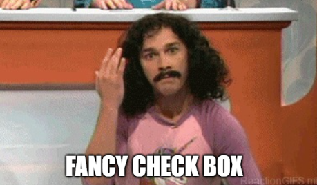

# Using the Checkbox

We need to modify the ViewTodos page, so that instead of displaying a textual value, we use the new 



[The code should be in this branch](https://github.com/TroelsMortensen/WasmTodo/tree/015_CheckBoxComponent)

## The Service
First, we must create a new method in TodoHttpClient responsible for making update requests.


#### Interface
Start by putting the following method into the interface `ITodoService`:

```csharp
    Task UpdateAsync(TodoUpdateDto dto);
```

We already have the `TodoUpdateDto` class, i.e. the argument, which is what the PATCH endpoint in your Web API needs.


#### Implementation
Now, we must implement the method in TodoHttpClient.

It is similar to the `CreateAsync()` method in this class. We must make a PATCH request, and check the response for error code.

However, where there is a `PostAsJson()` method, there is no `PatchAsJson` (which I find strange, but apparently you can [import it](https://docs.microsoft.com/en-us/dotnet/api/system.net.http.json.httpclientjsonextensions.patchasjsonasync?view=net-7.0) as an [extension method](https://learn.microsoft.com/en-us/dotnet/csharp/programming-guide/classes-and-structs/extension-methods)). So, we must use the client slightly differently.

This is then the method:

```csharp
public async Task UpdateAsync(TodoUpdateDto dto)
{
    string dtoAsJson = JsonSerializer.Serialize(dto);
    StringContent body = new StringContent(dtoAsJson, Encoding.UTF8, "application/json");

    HttpResponseMessage response = await client.PatchAsync("/todos", body);
    if (!response.IsSuccessStatusCode)
    {
        string content = await response.Content.ReadAsStringAsync();
        throw new Exception(content);
    }
}
```

First the dto argument is serialized to JSON. We do this manually, like a lowly pleb. That was otherwise handled for us when using `PostAsJson(..)`.\
Then we create a `StringContent` to hold the data in the body of the request message. We provide as arguments first the "dto as JSON", then the encoding, and finally the format of the string. We are sending JSON, so we pass "application/json". I don't know why it must be prefixed with "application/", maybe someone will some day google this, and tell me.

We make a Patch request with the client, providing endpoint URI and the content for the body.

Then the status is checked, and in case of errors from the server, we throw an exception, so we can provide feedback to the user. Business as usual.

## The View
First, we must import the component in ViewTodos.razor at the top:

```razor{4}
@page "/ViewTodos"
@using Domain.Models
@using HttpClients.ClientInterfaces
@using UIComponents
@using Domain.DTOs
@inject ITodoService todoService
```

Then we must modify the table definition to use the component. Here is the snippet:

```razor{20-22}
...
else
{
    <table class="table">
        <thead>
        <tr>
            <th>Todo ID</th>
            <th>Owner ID</th>
            <th>Title</th>
            <th>Completed?</th>
        </tr>
        </thead>
        <tbody>
        @foreach (var item in todos)
        {
            <tr>
                <td>@item.Id</td>
                <td>@item.Owner.UserName</td>
                <td>@item.Title</td>
                <td>
                    <FancyCheckBox IsCompleted="@item.IsCompleted" OnChange="@((status) => CompleteTodo(item, status))"/>
                </td>
            </tr>
        }
        </tbody>
    </table>
}
..
```

Notice lines 20-22. We previously displayed the `item.IsCompleted`. Now we use the FancyCheckBox component. This time we also set the properties.\
The `IsCompleted` property is set to the value of the `item` from the foreach loop.\
To the `OnChange` delegate we subscribe a lambda expression. The argument, `status`, is a bool, i.e. the value of the check box, and we pass that bool, along with the `item` variable to a method, yet to be created. See below. 

So the component is initialized with the IsCompleted value of the `item`, and whenever we click the checkbox, the `CompleteTodo(..)` method is called. Let's define that method next.

## The Code Block

We must add the new method to the code block, it looks like this:

```csharp
private async Task CompleteTodo(Todo item, bool status)
{
    TodoUpdateDto dto = new(item.Id)
    {
        IsCompleted = status
    };
    
    try
    {
        await todoService.UpdateAsync(dto);
    }
    catch (Exception e)
    {
        Console.WriteLine(e);
        msg = e.Message;
    }
}
```

First we create an instance of `TodoUpdateDto`. The ID must be set through the constructor, to indicate which Todo is to be updated.
The other properties are optional/nullable, so we only set the `IsCompleted`, because that is the only thing, we wish to change.

We pass the dto to the TodoHttpService, and display any error messages.

That should all, time for testing.

## Testing
Start Web API, start Blazor.

Navigate to View Todos page, load the list of todos.

Click on a check mark of an uncompleted Todo, and watch the box change to a checkmark. But is the data saved?

You just reload the page, or navigate to a different page and back again to reload the data. Be aware that modified Todos are at the bottom now.

#### A Bug?


Remember, on the server side we implemented a business rule stating that _completed Todo items cannot be uncompleted_.

Now, if you were to try to un-complete an item, that would sort of go medium-okay:
* You will see that check checkmark changes back to a box, indicating the Todo is no longer complete.
* You will also see an error message below the table, indicating the Todo could _not_ be un-completed.
* If you refresh the page, reload the data, you will see that the change was _in fact not saved_.

So, the server logic works. But the UI does not match the effect entirely.

#### A Fix?
We could attempt to make it so that when you click the checkbox, it would attempt to change the value, but in case of errors it would not change.

In the FancyCheckBox component, instead of the lambda expression simply invoking the EventCallback, we could have the `@onchange` call a method in the code-block of FancyCheckBox, which would invoke the EventCallback, and catch exceptions.  
In case of an exception we would set back the IsCompleted property. Or specialize it even more, and just check here if the value is true, then it cannot be changed to false.

We would have to re-throw the exception caught in ViewTodos::CompleteTodo.

Is it important to fix this bug for the purpose of this tutorial? Not really. So, I'll leave it for now, and maybe come back to it later.

