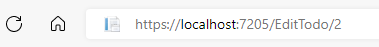

# Edit Todo Page

First, inside Pages, create a new page: "EditTodo".

The content is then:

```razor
@page "/EditTodo/{id:int}"

<h3>EditTodo</h3>

@code {
    
}
```

Notice we are back to "pages", as there is a @page directive at the top. Further notice I have added a bit extra:

```razor
@page "/EditTodo/{id:int}"
```

This means we can access this page with a sub-uri, e.g.:
* ...localhost:port/EditTodo/7

The idea is then, that the page will display Todo with ID 7. 
I don't specifically need the `:int` part, but this is a constraint. 
If we leave it out, e.g. `/EditTodo/{id}`, then `id` will be a string, and it must be assigned to a string property, 
and we would have to parse it to an int afterwards.

## The Code Block
We start with the code needed, there are several things going on, so you get the code in snippets. All goes into the code block.

#### Fields
```csharp
[Parameter]
public int Id { get; set; }

private TodoUpdateDto dto = null!;
private string msg = "";
private IEnumerable<User>? users;
```

It's a longer code block, with several things to notice.

**Lines 1-2**: Here we define the int property to hold the ID of the Todo we wish to edit. Remember, the value for this property was provided through the URI to the page: in the @page directive, we specified `/{id:int}`. 
Because the property has the same name (ignoring case) as the URI parameter, and is marked with the parameter attribute, the value from the URI will be pasted into the property when the page is accessed.

**Lines 4-6**: Various properties. `dto` will hold the data of the Todo we wish to edit, and then the modified data. `msg` is as always for user feedback. `users` is used in a drop down to select a User, if we wish to reassign a Todo to a different User.


### Loading data
Then comes the first method:

```csharp
protected override async Task OnInitializedAsync()
{
    msg = "";
    try
    {
        users = await userService.GetUsers();
        TodoBasicDto todoData = await todoService.GetByIdAsync(Id);
        User currentlyAssigned = users.First(user => user.UserName.Equals(todoData.OwnerName));

        dto = new(Id)
        {
            Title = todoData.Title,
            OwnerId = currentlyAssigned.Id
        };
    }
    catch (Exception e)
    {
        Console.WriteLine(e);
        msg = e.Message;
    }
}
```

**Line 6**: We load the users, so they can be displayed in a drop-down if the user wish to reassign a Todo.

**Line 7**: Here the specific Todo is fetched, given the `Id`.

**Line 8**: The `TodoBasicDto` contains only the User name, not the User id. So, we need to find the User in the collection, given the User name. 
The Id is used in the TodoUpdateDto. We can do this, because the server ensures, the User name is unique.

**Lines 10-14**: The `dto` property is initialized to a new `TodoUpdateDto`, with the data from the fetched TodoBasicDto.
We ignore the `IsCompleted` property, because that is updated in the View Todos page.\
We will bind input fields in the View to the `dto`, so the input fields will initially have values matching the Todo we are about to edit.

Now all the data is loaded.

### Updating data
And finally the Update method. Once the user has modified the data as needed, they click a button, which will call this method:

```csharp
private async Task UpdateAsync()
{
    try
    {
        await todoService.UpdateAsync(dto);
        navMgr.NavigateTo("/ViewTodos");
    }
    catch (Exception e)
    {
        Console.WriteLine(e);
        msg = e.Message;
    }
}
```

We hand over the `dto` to the ITodoService, and then we navigate back to the View Todos page.

In the Add Todo page, we included some basic checks for the data not being null or empty. We might do the same here.
I will leave that to the reader. Remember, the server also checks this, so it is not strictly necessary to have here.

## The View
The view will look pretty similar to the Add Todo page. The data which can be modified is the same as what was inserted when adding a Todo: Title and the User. So, we can steal much of the HTML to also make the page look similar.

We end up with this:

```razor
@page "/EditTodo/{id:int}"
@using Domain.DTOs
@using Domain.Models
@using HttpClients.ClientInterfaces
@using Microsoft.AspNetCore.Components
@inject ITodoService todoService
@inject IUserService userService
@inject NavigationManager navMgr

<div class="card">
    @if (users == null)
    {
        <label>Loading users...</label>
    }
    else if (!users.Any())
    {
        <label>No users, you cannot create a Todo</label>
    }
    else if (dto == null)
    {
        <label>Loading Todo data..</label>
    }
    else
    {
        <h3>Update Todo</h3>
        <div class="form-group field">
            <label>Title:</label>
            <input type="text" @bind="dto.Title"/>
        </div>
        <div class="form-group field">
            <label>Assignee:</label>
            <select @bind="dto.OwnerId">
                <option>Choose</option>
                @foreach (User user in users)
                {
                    <option value="@user.Id">@user.UserName</option>
                }
            </select>
        </div>
        <div class="button-row">
            <button @onclick="UpdateAsync" class="acceptbtn">Update</button>
        </div>
    }
    @if (!string.IsNullOrEmpty(msg))
    {
        <label style="color: red">@msg</label>
    }
</div>
```

We have the usual stuff at the top: page directive, using statements, injecting stuff.

We have the usual checks of things not being null or empty in the HTML, 
because we might get errors trying to render something from a `null`-variable. 
If there is no data, e.g. `!users.Any()`, the user should be informed.

The `else` part is the interesting stuff, again.

There is a text input field for the Title (line 28), with the data bound to the `dto.Title`. 
Notice here how we don't need a string field variable in the code block, like we did in the Add Todo.\
Often it is cleaner to bind data to the properties of a data object, like a DTO. 
This will potentially reduce the number of fields in the code block significantly, 
simplifying the code, and making it easier to reset things if needed, by just assigning the DTO to a new instance.

We have also again the drop down menu of all the users, lines 32-38.

Then there's the button (40-42), and finally the message for user feedback (44-47).

## Styling
If you moved the styles of CreateTodo.razor and CreateUser.razor to the global style sheet, the above HTML will reuse that, and all will be fine. Otherwise you may have to create a style-behind for this page.

## Testing
And that should be all for that feature. Sort of, almost. We still cannot navigate to the page from the nav menu.\
But you can access the page by manually typing in the URI in the browser's address bar. Let's try that.

Run Web API, and Blazor app.

Type in here:



Notice, your port may be different. And make sure to put a number which matches the ID of an existing Todo.

Modify some values: update the Title, and assign it to another User. Click the button, which will then take you to the View Todos page. Load the data to inspect your modified Todo. 
The Todo will now be at the bottom.