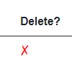

# Delete Todo View

We need to add a new column with an icon to the table in View Todos page.

We start with..

## The Code Block

We need a new method in the code block of the View Todos page.

It should take an ID, pass it to the Todo Service so that the Server can delete it.\
Then we also want to update the data in the view to reflect this deletion, if successful.

The method looks like this:

```csharp
private async Task RemoveTodo(int todoId)
{
    msg = "";
    try
    {
        await todoService.DeleteAsync(todoId);
        
        var list = new List<Todo>(todos!);
        list.RemoveAll(todo => todo.Id == todoId);
        todos = list.AsEnumerable();
    }
    catch (Exception e)
    {
        Console.WriteLine(e);
        msg = e.Message;
    }
}
```

Line 6 makes the call to the Todo Service.\
Lines 8-10 removes the deleted Todo from the `todos` collection, which holds the data shown in the view. This variable is an IEnumerable, which cannot be modified. So:
* First convert the IEnumerable to a List
* Then remove from the List
* Then assign `todos` to be the List converted to an IEnumerable.

It is a bit inconvenient. We could have made the `TodoHttpClient::Get()` method return an ICollection or IList instead, which might be easier to work with. But I don't want to go back and refactor that. The reader is welcome to use that approach instead.

Alternatively we could just call `LoadTodos()` again, to reload the todos from the server. This requires an extra call across the network, which may be resource heavy. It is the quick fix, but probably not the most efficient solution.
If there is no need to call the server, then there is no need to call the server

## The View

Open again ViewTodos.razor. We must edit the table. We will add another column with an icon to click, when a Todo should be deleted.

The table part of the view is shown here:

```razor{13,29-33}
...

else
{
    <table class="table">
        <thead>
        <tr>
            <th>Todo ID</th>
            <th>Owner ID</th>
            <th>Title</th>
            <th>Completed?</th>
            <th>Edit</th>
            <th>Delete?</th>
        </tr>
        </thead>
        <tbody>
        @foreach (var item in todos)
        {
            <tr>
                <td>@item.Id</td>
                <td>@item.Owner.UserName</td>
                <td>@item.Title</td>
                <td>
                    <FancyCheckBox IsCompleted="@item.IsCompleted" OnChange="@((status) => CompleteTodo(item, status))"/>
                </td>
                <td>
                     navMgr.NavigateTo($"/EditTodo/{item.Id}"))"/>
                </td>
                <td>
                    <label @onclick="@(() => RemoveTodo(item.Id))" style="cursor:pointer; color: red; font-weight: bold">
                        &#x2717;
                    </label>
                </td>
            </tr>
        }
        </tbody>
    </table>
}

...
```

Notice the new table column in line 13. And in lines 29-33 we define the content of that column to be an icon, given by the code `&#x2717;`, which is a red X:



Obviously we could have used an actual icon file, like the funnels or the edit. But this special _x_ is fancy. And you know, we like fancy.

The `<label>` tag contains an `@onclick`-handler, i.e. a lambda expression to call the `RemoveTodo()` method defined above. I also have a bit of inline styling. You may move this to a css file, if you prefer. You probably have a style-behind for ViewTodos.razor.


## Testing

It is time to test the feature. Run the usual. Navigate to View Todos. Load all Todos.

First: Try to delete an un-completed Todo. The server should not allow you to. You should see the error message below the table.

Then: Delete a completed Todo. If you have none, then first complete a Todo. You should see the view be updated. To verify the deletion was saved on the server, navigate to a different page, and back, and reload the Todos.