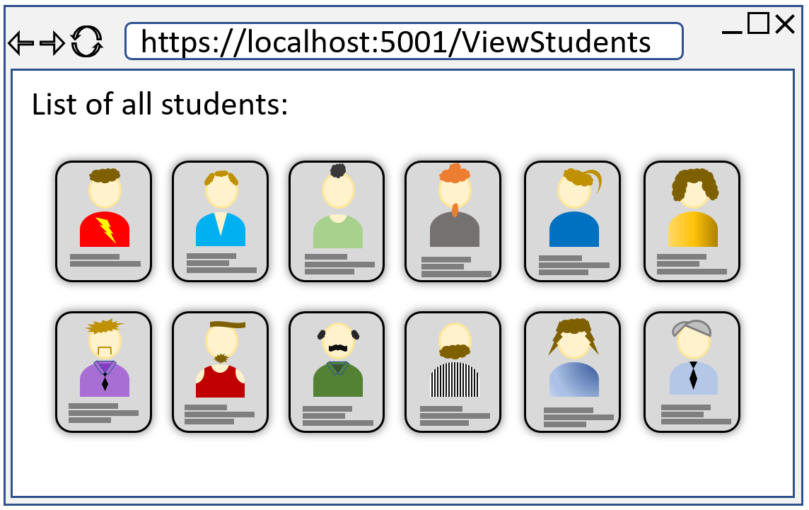
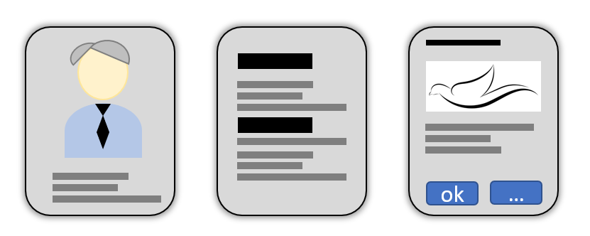

# Component Communication

It has been mentioned before: Blazor is very modular when components are used. We have already done one component: the FancyChecBox, the purpose of which was to provide a re-usable UI element.

The re-usability is a big motivator for using components. Another factor is clarity of the code. HTML tends to get a bit incomprehensible when the code grows to many lines. Pieces of the HTML can be split out into smaller components to organize the HTML in a different way.

When using components, we often need to pass data from one to another. There are different ways of doing that.

## Passing Data
Depending on whether you have a page or a component, and also how pages/components are associated, passing data between them can follow various patterns. The purpose of this slide is to show the different ways of passing data back and forth between pages and components

### Data to a Page
Whenever you navigate to a new page, sometimes we wish to provide data to that page, so that it can load and display the relevant data.

We have already seen an example of this: using a route parameter. This was covered in slide 30.

We can define a page URI which includes a single, simple parameter. Often just an int or a simple string. In that way it is somewhat similar to how we may define routes to endpoints in the Web API.

We must define the page-directive, and a public property to hold the data:

```razor
@page "/EditTodo/{id}

@code {
    [Parameter]
    public string Id {get;set;}
}
```

By default, the property is a string, but as seen we can put a constraint on the route argument: `{id:int}`, which converts it to an int.

This is the primary way of passing data to a page.

There is sort of an alternative, which uses the observer pattern. This will be covered later.

#### With Query Parameters
Similar to what we can do with Web API endpoints and query parameters, we can do that for the URI of a blazor page.

[This post covers that under the section "QUERYSTRING PARAMETERS"](https://www.coderschmoder.com/five-ways-to-pass-data-from-one-blazor-component-to-another/)

You put nothing extra in the page directive, but have a couple of properties marked with [Parameter] and [SupplyParameterFromQuery]. Here's an example:

```razor
@page "/displayemployee"
<h3>Display  Employee</h3>
<p>Employee Id: @Id</p>
<p>Department: @Department</p>
<p>Employee First Name: @FName</p>
<p>Employee Last Name: @LName</p>
@code {
    [Parameter]
    [SupplyParameterFromQuery]
    public int? Id { get; set; }
    [Parameter]
    [SupplyParameterFromQuery]
    public int? Department { get; set; }
    [Parameter]
    [SupplyParameterFromQuery]
    public string? LName { get; set; }
    [Parameter]
    [SupplyParameterFromQuery]
    public string? FName { get; set; }
}
```

### Data to a Child Component

When a component `CompA` is used inside a page (or other component) `PageB`, 
the CompA is considered a "child" of the PageB, which is the "parent".

Take this example (which I spent _way_ too long time designing):



There is a page displayed, with some text. 
The "cards" ([a "card" is common concept](https://www.w3schools.com/howto/howto_css_cards.asp)) each display some information about a student, and the profile-image. This card could be defined as a component, we would then generate a number of "card-components" equal to the number of students,
and provide each card-component with a `Student` object containing the student information.

It might look something like this:

```razor
@foreach(Student stud in students) {
    <StudentCard Student="@stud"/>
}
```

Where the body of the for-loop is the component.

In this way a _parent_ (whether it is a page or component) can pass data to a _child_.\
This is somewhat similar as passing arguments to a constructor of a class. Here, we can pass variables as arguments as well.

The `Student` property in the `StudentCard` component must be marked `[Parameter]`, e.g.:

```razor
<div class="card">
    
    <p>@Student.Description</p>
</div>

@code{
    [Parameter]
    public Student Student {get;set;}
}
```

We used this approach with the FancyCheckBox, where we passed in the initial boolean value of the check-box.

### Data to a Parent Component

Sometimes a child-component needs to pass data back to a parent-component (or -parent). 
We do this using a delegate, more specifically the `EventCallback`. We did this in the in the FancyCheckBox. When the check-box was clicked, the EventCallback was invoked with the new value. 

```razor
@code {
    [Parameter]
    public EventCallback<bool> OnChange { get; set; }
}
```

And subscribing a method to the EventCallback:

```razor{3}
<FancyCheckBox 
    IsCompleted="@item.IsCompleted" 
    OnChange="@((status) => CompleteTodo(item, status))"
/>
```

We provide it with either a lambda-expression or a method reference.

### Child Content
Sometimes, it is convenient to pass more than just data to a component. We can actually pass an entire snippet of HTML (with other components or razor-syntax). 

Assume we make a Card component (like above), but it is intended to be reused for various types of cards across. It could be the students from the example above, but we might wish to use the same card for presenting other data. And maybe the card has some extra functionality, so that we cannot just achieve this with a `<div class="card">`.
Here are is the idea of the same card but with different content:



Or, you can consider these slides, they behave similarly, have buttons at the top and bottom, but the content is different.

We can then define a component, which can receive the content as a kind of parameter. It might look like this:

```razor
<MyFancyCard>
    <div class="student-card-content>
        
        <p>bla bla bla<p>
    </div>
</MyFancyCard>
```

The outer tag `<MyFancyCard>` is actually a component. The inner content, lines 2-5, is the "child-content", i.e. the content we wish to display in the card.

The `MyFancyCard` component might then be defined as:

```razor
<div class="fancy-card">
    @ChildContent
</div>

@code {
    [Parameter]
    public RenderFragment ChildContent {get;set;}
    
    ...
}
```

The property must be exactly like this, the type, and the name. This property will then receive the HTML from above, and we can put it in the view of the component with a reference, as in line 2.

We will use this on the next slide to create a popup dialog.

### Data to a Sibling Component

Finally, you may have a page containing two (or more) components. So the page has two child-components, but the components do not know about each other, i.e. neither component is parent/child of the other: They are siblings.\
The web site design above show multiple cards, each card a component, all cards at the same level in the HTML, so they are siblings.

If you are industrious with regards to refactoring your page into smaller components, you may end up in this situation, where you click a button in one component, and you wish to update the view in another component.

To achieve this, we use a "state container". It a simple class, which has a delegate and a piece of data. Then we need a set-method to set the data, which will also invoke the delegate. The components will subscribe their own methods to the delegate, and upon invocation will update their view accordingly.\
The state container must be registered as a _scoped service_ in Program.cs, and injected into the components. Alternatively, when using Blazor WASM, a singleton pattern might also achieve this effect.

This could be an example of a state container:

```csharp
public class StateContainer{

    private int number = 0;
    public Action<int> OnChange {get;set;}
    
    public void SetNumber(int i){
        number = i;
        OnChange?.Invoke(number);
    }
}
```

The two components will interact with each other through this StateContainer:


I have the ambition of showing a very simple example at the end of this tutorial.
