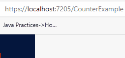

# State Container Example

The purpose of this example is to show a way for communication between "sibling" components.

The idea is that we have a class, which is registered as a scoped service, i.e. the StateContainer class.\
It is injected into all the components, which wish to communicate.\
A component may call a method on the StateContainer, which will then invoke its internal delegate.\
Methods from the components are subscribed to this delegate.

We will just expand on the simple Counter example, which comes with the default Blazor template. So, this has nothing to do with the Todo tutorial.

[The code is found in this branch.]()

## The StateContainer

First, we need the state container, this class holds the shared data.

You can put it where, if you are implementing along here. I have created a new directory: BlazorWASM/StateContainers.

Here, I place a new class, "CounterStateContainer". The code looks like this:

```csharp
namespace BlazorWASM.StateContainers;

public class CounterStateContainer
{
    public Action<int> OnChange { get; set; }

    private int count = 0;

    public void Increment()
    {
        count++;
        OnChange?.Invoke(count);
    }
}
```

We then register the CounterStateContainer as a scoped service in Program.cs.

```csharp
builder.Services.AddScoped<CounterStateContainer>();
```

## Counter Component

Create a new Component, e.g. "CounterComponent". I've put mine in the UIComponents directory.

This is the code:

```razor
@using BlazorWASM.StateContainers
@namespace UIComponents
@inject CounterStateContainer stateContainer

<div>
    <label>Counter @Id</label>
    <label>@count</label>
    <button @onclick="stateContainer.Increment">Increment</button>
</div>

@code {
    [Parameter]
    public int Id { get; set; }

    private int count = 0;

    protected override void OnInitialized()
    {
        stateContainer.OnChange += i =>
        {
            count = i;
            StateHasChanged();
        };
    }
}
```

The first line is to import the StateContainer. Then the namespace declaration.\
In the third line we inject the CounterStateContainer. Because it is registered as "scoped" in Program.cs, whenever a page/component requests an instance of CounterStateContainer, it will be the same instance. Until the app is refreshed. Then a new shared instance will be created.

The view is just a labe with text, then a label to display the current count, and then a button.\
When the button is clicked, the `CounterStateContainer::Increment()` method is called. I have here made a method reference. Alternatively the same could be achieved with a lambda expresion:

```csharp
() => stateContainer.Increment()
```

The code block holds a Parameter int, so that multiple instances of the component can be distinguished. It's not really all that important.\
There is a field for the current count.

In the `OnInitialized` method, which is called when the component/page is rendered, we subscribe some functionality to the delegate in the CounterStateContainer.

First, the argument `i` is what the CounterStateContainer sends. We assign that to `count`. Then, we have to tell the component, that some change has occured, and it should update. We do this by calling `StateHasChanged()`. This is usually needed, when the change to a field comes from outside of the component, in this case the state container.\
When the changed is initiated internally in the component/page, it can usually figure out to update the view by itself.

The idea is to put two instances of this component into a page. When the button of one instance is clicked, the `Increment` method of CounterStateContainer is called, which will push out the new int value to interested parties, i.e. our components. They will then update their internal state, i.e. the `count` appropriately.


## Counter Page
Let's test this.

Create a new page, e.g. "CounterExample" in directory Pages.

It looks like his:

```razor
@page "/CounterExample"
@using UIComponents

<CounterComponent Id="1"/>
<br/>
<CounterComponent Id="2"/>

```

It is pretty empty, we just insert two instances of the CounterComponent, with different ids.

Run the app.

Manually navigate to the page, by typing in the URI in the browser's address bar.

You should see something like below, and if you click either button, both counters are updated.



So, that is the very basics of communication between components/pages, which are do not have a parent-child structured relationship.