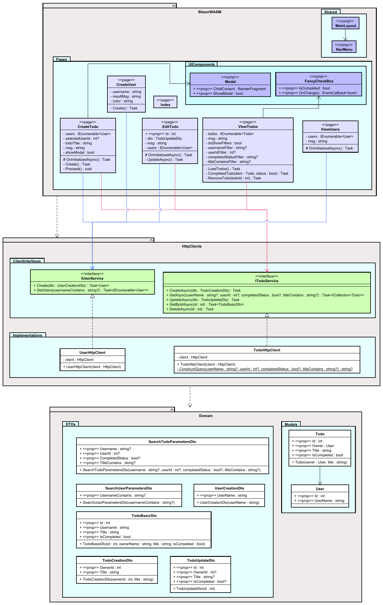

# Conclusion

This concludes the tutorial.

We now a working end-to-end Todo app. 

You have seen how to:
* define different views with pages.
* dynamically generate a view using HTML and razor syntax.
* use the HttpClient to make requests of the Web API.
* navigate between pages
* rearrange the template UI structure
* work with components in various ways 

There is plenty more to learn, but with these basics you are off to a very good start.

## Class Diagram

I display here again the class diagram, because now you have a better basis for understanding it.

You may notice, I have forgotten to suffix some methods with async, e.g. in `IUserService`, and several pages. It is super important to fix, so that will not happen. That a method is asynchronous is also implied by the return type of Task.

Notice how pages are marked with the **stereotype** "page", and components are marked with "comp".

The grey boxes are components, identified by the lille upside-down fork thingy at the top.

I have a habbit of color coding things:
* Components are grey
* Directories are blue, with the blue becoming darker for each nested directory. See Pages and UIComponents.
* Pages are light purple, and components are dark purple
* Class are white
* Interfaces are green
* I take care to collapse association arrows neatly, and sometimes it helps to provide different colors to different groupings of arrows, i.e. the red and blue.

These are just my own conventions, you need not follow them. As long as you take care to make your diagrams readable.