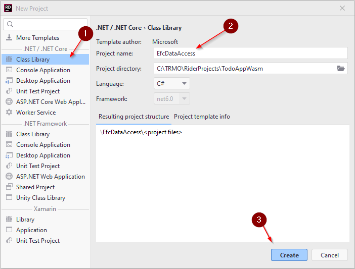
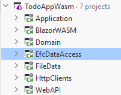
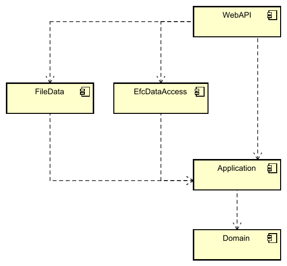

# New Component

Let us go ahead and create a new component/project in your solution.

It is a class library, call it "EfcDataAccess".

Which will result in a solution structure like this:

Your new library contains a dummy `Class1`, delete it.

## Dependencies

The below is a component-diagram, and the dotted arrows shows the inter-component dependencies. Most of them was setup in the first tutorial:

Remember how the dependencies were supposed to flow according to Clean Architecture. The ones from WebAPI to Data components is unfortunate but necessary.

### Who knows about who?

Application depends on Domain.

The WebAPI depends on Application, because the Controller classes need to call the methods in the Logic interfaces.

The FileData depends on Application, because the DAO classes in FileData must implement interfaces located in Application.

The WebAPI also knows about FileData and EfcDataAccess, only because it is in WebAPI/Program.cs we register services, including the implementations of the IUserDao and ITodoDao interfaces.

Because of transitive dependency both WebAPI, FileData, and EfcDataAccess knows about Domain.

We need to set up two new dependencies:

* WebAPI -> EfcDataAccess
* EfcDataAccess -> Application

Go ahead and do that.