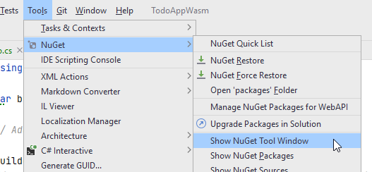
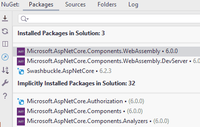

# Add EFC Packages

Entity Framework Core (EFC) is an "**O**bject **R**elational **M**apper". 
That means it can generate a **relational** database, with tables, attributes, relationships (foreign keys), etc, based on your domain classes, and their associations.

In our case we have a `Todo` and a `User` object, with an association from Todo to User, as the assignee.

If we use these model classes as the basis for EFC, it will generate two tables: Todos, Users. And there will be a foreign key from a Todo to a User.

We don't have to use SQL at all.

## Add NuGet Packages
First, we need to include some packages in our EfcDataAccess project, so that we get access to the EFC functionality.

Open the NuGet manager, in Rider it's found here:

Or you can find a tab in the bottom bar in Rider.

You need to add three packages to EfcDataAccess:

* Microsoft.EntityFrameworkCore
* Microsoft.EntityFrameworkCore.Design
* Microsoft.EntityFrameworkCore.Sqlite

It is done like this:

1) You search for the package. 
2) You select the correct package from the search results. 
3) You select the correct version. And which is that? All three packages should be the same version. At the time of writing the latest is 6.0.9. Pick the latest version, **which is not marked _preview_ or _rc_** (whatever rc means), these are "beta" versions.
4) Then you click the plus icon for the project to which you want to add this package.
5) You click <kbd>Install</kbd> in the popup

Do this for all three packages. 

`Microsoft.EntityFrameworkCore` and `Microsoft.EntityFrameworkCore.Design` is always needed, together they let you generate a database based on your domain classes.

`Microsoft.EntityFrameworkCore.Sqlite` is needed because we are going to use SQLite as our database. If you wish to use to use another database, e.g. MySQL or MSSQL or PostgreSQL, you'll have to import a specific NuGet package for that.
