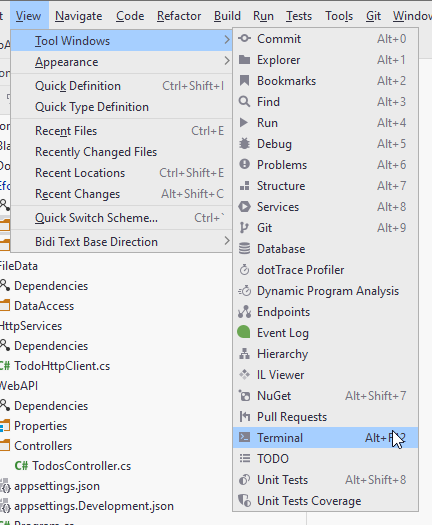
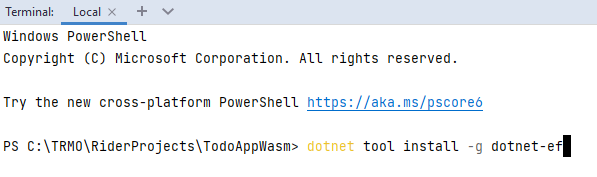

# Installing Db Tools
You will need to install a command line interface (CLI) tool, which is used when creating/updating the database. This should be needed only once.

Open the terminal in Rider:

The terminal can also be found in the bottom menu bar of Rider, next to the NuGet package manager tab.

In the terminal type (it shouldn't matter which directory, you're in):

`dotnet tool install -g dotnet-ef`

The `-g` means the tool is installed globally, and so you shouldn't have to install it again, if you create a new solution, e.g. for your SEP3.

