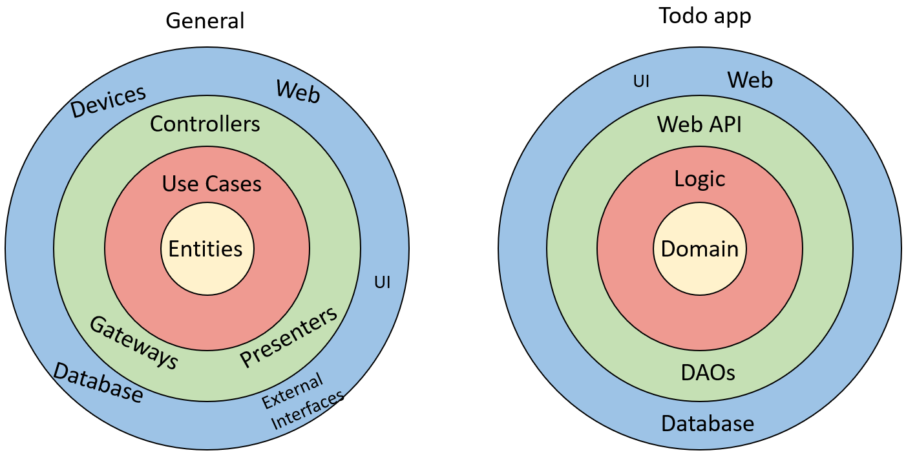

# Configuring the Tables

Now, we need to add some information to be used when the database is generated. This includes:

* The attribute to use as Primary Key for each domain class
* Various constraints on the attributes, e.g. length, range, optional/required

There are two approaches: 
1) data annotation attributes in domain classes
2) define it in DbContext subclass, i.e. the TodoContext

I will show both approaches here, and provide some discussion, so that you may prefer one approach over the other. Or a mix of the two.

## 1. Data Annotation Attributes
You have seen various attributes before, e.g. on the endpoints in your REST controllers, we would put `[HttpGet]`. And on the Controller itself we put `[ApiController]`.

We can also put attributes in our domain classes to define the above mentioned configuration.

##### Primary Key
We have the property `Todo::Id`, it already acts as a "primary key", it is a unique identifier for a Todo.

If the property is called "Id", EFC will usually infer that this is the primary key. 

If the property is called "<class-name>Id", i.e. "TodoId", or "UserId", EFC will usually infer that this is the primary key.

In both cases, I believe the property must be of type `int` (not entirely sure, though).

You can also manually define a primary key property, by adding the `[Key]` attribute to a property:

```csharp{3,4}
public class Todo
{
    [Key]
    public int Id { get; set; }
    public User Owner { get; }
    public string Title { get; }

    public bool IsCompleted { get; set; }

    public Todo(User owner, string title)
    {
        Owner = owner;
        Title = title;
    }
}
```

I prefer to be explicit. It minimizes confusion, I believe.

If you do it like this, have an `int` Id, it will become `SERIAL`, i.e. if you don't provide a value other than `0`, the database will generate the value of the Id based on the next available number.

##### Constraints

We can also define various constraints, as mentioned above. This can be done with attributes too.

If we make a property _nullable_, i.e. append a "?" on the type, like `int?`, we make that attribute in the database nullable: it is allowed to not be set. If we don't make a property nullable, then it is by default required in the database.

We can set a max length on e.g. `Title` like this:

```csharp
[MaxLength(50)]
public string Title { get; }
```

We can define an allowed range on number types with e.g. `[Range(0,250)]`.

[You can find more attributes here](https://learn.microsoft.com/en-us/ef/ef6/modeling/code-first/data-annotations)

##### Web API and Blazor
If we apply these data attributes, they are actually also used by the Web API. Before an endpoint with a Todo argument is called, the data from the client is validated using the attributes. If the incoming data violates your attribute constraints, the request will just be denied, and not reach your endpoint.
[Read about Web API model validation here](https://learn.microsoft.com/en-us/aspnet/web-api/overview/formats-and-model-binding/model-validation-in-aspnet-web-api)

Similarly, Blazor has a built in input-form with various components. These will also use the attribute to validate the data.
[Read about the Blazor input forms here](https://learn.microsoft.com/en-us/aspnet/core/blazor/forms-and-input-components?view=aspnetcore-6.0). You were specifically not taught these, because making things from scratch gives you freedom. But now you know the basics, you are welcome to use various built in functionality or 3rd party libraries.

## 2. OnModelCreating(..) Method

This way does not require modification to the domain classes. We can set similar configuration by overwriting this method in the DbContext sub-class.

##### Primary Key

As above, the Key can be inferred by the naming of the property.

Alternatively, we can define primary keys on User and Todo like this (in `TodoContext`):

```csharp
protected override void OnModelCreating(ModelBuilder modelBuilder)
{
    modelBuilder.Entity<Todo>().HasKey(todo => todo.Id);
    modelBuilder.Entity<User>().HasKey(user => user.Id);
}
```

In this way, we say that the entity "Todo" has a key, and the lambda expression defines which property to use as the key.

##### Constraints.

You can also do some the constraints in `OnModelCreating(..)`. Here is an example of limiting the `Todo::Title` to 50 characters:

```csharp
modelBuilder.Entity<Todo>().Property(todo => todo.Title).HasMaxLength(50);
```

It seems you can not do exactly the same constraints as with the attributes. E.g. I have found no Range, or MinLength.

So, if you really need those constraints, you may have to use attributes as well.

### Do We Need Constraints?

Now, whatever constraints we apply, they should obviously match the validation rules we implemented in the logic layer.

And because we already validate things in the logic layer, we could just neglect them in the database.

If we have the rules two places (or three if you do them in the client as well), then you will also have to update multiple places, if you need to change something.

We could then consider just having the constraints in the database, and not in logic layer. But then the logic layer needs to trust those rules are enforced elsewhere, which is probably not a good idea.\
What if you change database and either forget some constraints, or your new database simply does not support that kind of constraint? You must then implement the constraint in the logic layer.\
You will have to evaluate options and make a qualified choice.

## Discussion
So which approach do you use? Attributes or the OnModelCreating method.

Many .NET EFC examples will gladly put the attributes in the model classes, and also use the `OnModelCreating()` method. This is also true for their Web API examples, and Blazor examples. And this can be just fine. 

However..

#### Clean Architecture
Remember the Clean Architecture. General diagram on the left, our own system on the right:



On the right side is the structure for the Todo App. The general diagram (left) also considers things like using some third party api (external interfaces), and the web, and various devices (keyboard, mouse, hard drives, etc).
The right hand diagram shows only what is relevant for our app.

We have three layers: Web API, logic, data access. And we have a domain component with the domain classes (and other stuff). These things are located in the green, red, and yellow rings.
The blue is everything outside of that, outside the code of our server app: The client app (Blazor), the file/database where the data is stored, 3rd party stuff.

Dependencies go inward: A ring knows about the ring _inside_ it. A ring knows nothing about the ring _outside_ it. 
Compare this to the component diagram and inter-component dependencies shown on slide 3.\
Here's the important part: **An outer ring may not cause changes to an inner ring**.\
What does that mean?

* The database is in an outer most ring (blue). If we initially use a relational database like Postgres, and later want to change to something else, it should not cause change anywhere else than the Gateways (our DAOs).
* If we swap out the REST Web API with a gRPC server, it should not cause changes to the red or yellow rings, i.e. logic or domain.
* If we introduce new logic rules, it should not cause modifications to the Domain.

This is at least the ideal, when doing a Clean-architecture approach, as we have attempted.

#### Attributes approach
If we use this approach, we need to modify the domain classes, i.e. the yellow ring. 
Because of something in the green ring (DAOs). We use EFC (or Web API) and therefore, we modify the _Domain_.\
If we change to not use EFC (or the Web API), these attributes are no longer relevant, and shouldn't be there.\
This means that a change to the outer green ring, will cause a change to the inner yellow ring, and it goes against what is dictated by Clean architecture.

#### OnModelCreating appraoch
If we use this approach, all setup is done in the green ring, in the DAOs/Gateways area. 
We need not touch the Domain. If we later remove EFC, and introduce a file storage again, or 
just manually typing the SQL as in SEP2, or use a document based database, or whatever else, it will not cause changes to the Domain (inner yellow ring).\
So with this approach, we adhere to the Clean principles.

#### Conclusion
Based on the above, you may conclude that you shall not use the attributes. That is not strictly true. As mentioned, many .NET examples will gladly use these attributes, and often together with the OnModelCreating method. The point is just that you make an informed choice.

It is not that often a database is swapped out. And if you use EFC and swap out one relational database for another, it is minimal work.\
If you swap out a relational database for a document based, you will no longer need the attributes in Domain classes, but on the other hand, in this case they do nothing. So you may not need to remove them.


## Configuring the tables
For now, the approach of this tutorial will be the OnModelCreating, without constraints.\
In TodoContext, we then have the following method:

```csharp
protected override void OnModelCreating(ModelBuilder modelBuilder)
{
    modelBuilder.Entity<Todo>().HasKey(todo => todo.Id);
    modelBuilder.Entity<User>().HasKey(user => user.Id);
}
```

Now, we have configured each table, with keys and constraints. What about relationships, i.e. foreign keys? This is how we bind the data together.\
We will discuss that next, because there are again some considerations, and different approaches.
