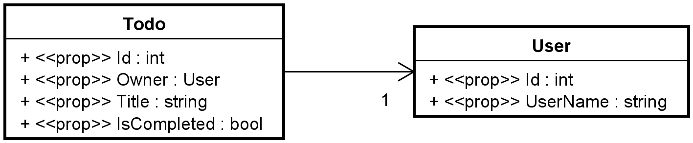

# Configuring Relationships

An object oriented model have relationships between model classes, usually in the form of associations. Our domain classes are like this:



This means, the Todo has a reference to its owner, a User. The Todo knows about the User, but the User does not know about the Todo.

We could have flipped the association, and said the User includes a list of all their Todos.

The intention is that **"a user can be assigned to many todos"**.

Usually in the object oriented domain, the relationships between classes are one-way, as above.

## Generating Tables
If we generate the database now, we will get a table per domain class, i.e. Todo and User.
We will get a relationship between them as shown in this EER-diagram:


Notice there is no "Owner" on Todo, because that is implied by the relationship.

And if you know your databases, you know this is implemented in the database as these tables:

---
### Relational schema

**Todo**(Id, Title, IsCompleted, Owner)\
**Primary key**: Id\
**Foreign key**: Owner **references** User(Id)

**User**(Id, UserName)\
**Primary key**: Id

---

So, the Todo gets a foreign key to the User.

This is what EFC will generate for us, whether we use the object oriented association of "Todo -> User" or "Todo <- User". Either way, it is a 1:* relationship, which results in the above relational schema.

## What is a Navigation Property?

The relationship is implemented in the database as a foreign key, and in the domain classes, we use an association, i.e.:
* Todo has an association (Owner) to User, or
* User could have a list of Todos

This association is called a "Navigation Property", it is used to navigate around between objects. 
Essentially it is an object oriented implementation of a foreign key. 

## Two-Way Navigation Properties

Currently, our domain classes have a one-way navigation property, i.e. Todo -> User.

Sometimes, you may want to make a two-way relationship, i.e. add Navigation Properties on both sides. This can vastly simplify some queries against the database, depending on what side of the data you start from. Example:

* If you want to load a Todo with the User, it is easy because the Todo includes the User.
* If you want to load a User with all its Todos, it is much more complicated, because Users do not know about their Todos.

In the latter example, you would have to go through all Todos, and check if their User is the one, you wish to load.

If we add a Navigation Property, User -> Todo (i.e. the list in User), it is easily loaded: Find a User, also load the associated Todos.

So, often it is a benefit to have two-way navigation properties, and this is commonly seen.

The classes would then look like this:


Notice the User has a collection of all Todos assigned to it.


## Update to Domain Classes
This means an update to the User class, it looks like this:

```csharp
public class User
{
    public int Id { get; set; }
    public string UserName { get; set; }

    public ICollection<Todo> Todos { get; set; }
}
```

Things should be good now.
