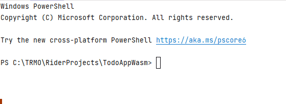
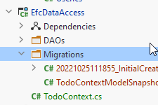
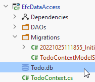

# Create the Database

We have done the configuring and we are ready to let EFC generate the database for us.

First, we must generate a Migration. This is a file containing information about how to create/update the database.

Every time the domain classes change or a new class is added, we need to create a new migration, and apply it to the database.

In this way the database can be regularly updated.

## Modify Todo
First, we need to modify the Todo class. It currently looks like this:

```csharp
public class Todo
{
    public int Id { get; set; }
    public User Owner { get; }
    public string Title { get; }

    public bool IsCompleted { get; set; }

    public Todo(User owner, string title)
    {
        Owner = owner;
        Title = title;
    }
}
```

We have set properties for Id and IsCompleted, but not the other two. They are read-only. They are instead set through the constructor.

The current setup with a constructor and some read-only properties is because of various code in the logic layer.\

EFC needs a little more:
* There must be set properties for all fields. They may be private.
* There must be a no-arguments constructor for EFC to call when creating objects.


So, this is a bit annoying, but it will not cause must of a ripple effect.

The Todo class should be changed to:

```csharp
public class Todo
{
    public int Id { get; set; }
    public User Owner { get; private set; }
    public string Title { get; private set; }

    public bool IsCompleted { get; set; }

    public Todo(User owner, string title)
    {
        Owner = owner;
        Title = title;
    }
    
    private Todo(){}
}
```

Notice the `private set;` properties on `Owner` and `Title`.

Notice the private constructor.

These two additions are for EFC, but it has no effect on the rest of the system. We have not exposed anything, we shouldn't. We have not cause relevant changes.\
So, this is acceptable, albeit a little unfortunate.

##### Comment

The tutorial was written on the fly, and I did not originally know about this problem with EFC. 

##### Comment 2

I originally made a different kind of modification to the Todo, which caused changes in Logic. I believe this has been removed from the tutorial.

## Generate a Migration

A migration is created through the terminal (or command line interface).

Open the terminal.

Navigate to the EfcData project. Most likely when you open the terminal, it is located in the solution directory. You want to enter the EfcDataAccess directory:
```
cd EfcDataAccess
```

Or like this:



Once there, type in the following:

```
dotnet ef migrations add InitialCreate
```

The last part, `InitialCreate`, is the name for the migration we are about to create. 
You should generally call it something, which indicates what this migration does, 
e.g. "UserEntityAdded", "TodoEntityUpdated", "EmailAddedToUser", or something similar. These names can be compared to Git commit message.\
Migrations are sort of a form of version control, similar to how you use Git.

Execute the above command. You should get:

```
PS C:\TRMO\RiderProjects\TodoAppWasm\EfcDataAccess> dotnet ef migrations add InitialCreate
Build started...
Build succeeded.
Done. To undo this action, use 'ef migrations remove'
PS C:\TRMO\RiderProjects\TodoAppWasm\EfcDataAccess>
```

Now, look in the EfcDataAccess component, you should see a new folder, Migrations (it may take a second or two to update the UI. You may need to collapse EfcDataAccess and open it again). 



Here is the "version control" of your database. 
These files keep track of the modifications to your code, which should eventually be applied to the database. 
And the files keep track of which of the migrations are actually applied, and which are not. 
Maybe you have a few migrations, which have not yet been applied to the database.\
When you then update the database, EFC will figure out the difference, and apply the necessary migration(s).

This folder should probably also be under version control for your projects, so that when one group-member changes the database, the others can get the update.

#### Deleting the Migrations
Sometimes, you may want a "hard reset", if you somehow mess up. You can delete the Migrations folder, along with the database file generated on the next slide, and start over.

This can best be done with SQLite. When using other databases, go google how to revert a migration instead.

Applied migrations can be reverted to a previous migration. Un-applied migrations can just be removed.

## Apply a Migration
The next step is to apply the migration to your database. Currently we have no database,
so it will be created the first time we apply an update.

Again, in the terminal, and in the EfcDataAccess directory, we use the following command:

```
dotnet ef database update
```

Like so:

```
PS C:\TRMO\RiderProjects\TodoAppWasm\EfcDataAccess> dotnet ef database update
Build started...
Build succeeded.
Applying migration '20221025111855_InitialCreate'.
Done.
PS C:\TRMO\RiderProjects\TodoAppWasm\EfcDataAccess>
```

Whenever a new migration is created (or multiple), you can do the above to apply them all.

Again, in the EfcDataAccess component, you should now see your database file:



SQLite is just a single file, which makes it very easy to work with. This file can actually also be put under version control, should you wish to.\
This could ensure an easy way to let all group members have the same data set.

## Update path

Finally, in the TodoContext, we have the piece of code, which points to the db file:

```csharp
protected override void OnConfiguring(DbContextOptionsBuilder optionsBuilder)
{
    optionsBuilder.UseSqlite("Data Source = Todo.db");
}
```

This is a relative path, from the EfcDataAccess component root. However, the program is started from WebAPI component. 
So, the path to the SQLite file should be relative to that component. Modify the above code to:

```csharp
protected override void OnConfiguring(DbContextOptionsBuilder optionsBuilder)
{
    optionsBuilder.UseSqlite("Data Source = ../EfcDataAccess/Todo.db");
}
```

The `..` means to navigate to a parent folder, which is TodoAppWasm solution folder. Then into the EfcDataAccess folder (component), and the the Todo.db file.

Alternatively, you can provide the absolute path, something like:

```
C:\TRMO\RiderProjects\TodoAppWasm\EfcDataAccess\Todo.db
```

However, that path will be different between group members, so you would have to modify it. 
Even more alternatively this can be put into a local configuration file, which is not under version control. 
You'll have to google how to do this, if interested.
