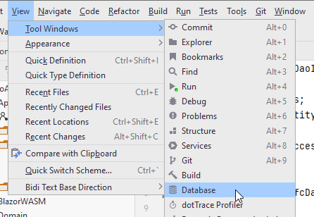
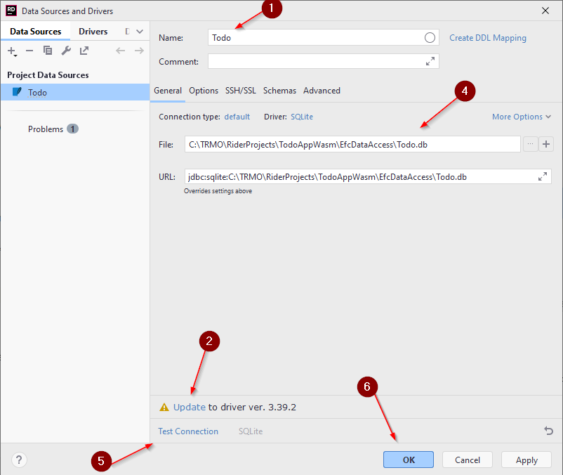
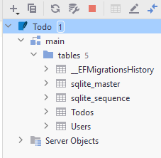

# Add User Functionality

We are ready to update the first user story, adding a new user.

The code for the rest of the tutorial can be found in [this branch](https://github.com/TroelsMortensen/WasmTodo/tree/020_EfcAddUser)

## Add TodoContext as a Service
In WebAPI/Program.cs we already added UserEfcDao and TodoEfcDao as services. 

We now need the TodoContext, so that it can be injected when needed.

Add the following:

```csharp
builder.Services.AddDbContext<TodoContext>();
```

This method has an overload which takes an argument, where you can specify the database connection string. We did that in the TodoContext, where we said "Data source = Todo.db", but it can also be done here.\
This latter approach seems to be the usual, though it doesn't change much for us. It does however make it easier to change database, if we provided the connection info in Program.cs instead. You may google how to, if you wish.

## Inject TodoContext

First, we must inject a TodoContext into the *EfcDao classes, similar to how we injected a FileContext in the *FileDao classes.

Add the following code to UserEfcDao:

```csharp
private readonly TodoContext context;

public UserEfcDao(TodoContext context)
{
    this.context = context;
}
```

And do similar for the TodoEfcDao, now that your at it (obviously the constructor is named differently in that class).

## Add User Method
Open the class UserEfcDao. We need to implement the method bodies now.

We start with the `CreateAsync()` method.

The interaction with the TodoContext will be pretty similar to how we used the FileContext. However, we don't need to manually calculate and set the Id. This is done by the database, when the Id is an `int`, and we provide the value `0`. 

The code looks like this:

```csharp
public async Task<User> CreateAsync(User user)
{
    EntityEntry<User> newUser = await context.Users.AddAsync(user);
    await context.SaveChangesAsync();
    return newUser.Entity;
}
```

The database sets the Id of the User, which is why it may be relevant to return the created User, now with the correct Id.

We can now also use the asynchronous functionality of the DbContext class.

## GetByUsername Method

This method is used, because before adding a new User, the logic layer will ask whether the selected user name is taken.\
So, we need to implement this method as well.

It should behave similarly to the same method in UserFileDao.

Give it a go yourself first. You cannot use `Equals(userName, StringComparison.OrdinalIgnoreCase)`, as this cannot be translated to SQL.\
Instead you can do `u.UserName.ToLower().Equals(userName.ToLower())`, i.e. make both user names lower case and compare.

<details>
<summary>hint</summary>

```csharp
public async Task<User?> GetByUsernameAsync(string userName)
{
    User? existing = await context.Users.FirstOrDefaultAsync(u =>
        u.UserName.ToLower().Equals(userName.ToLower())
    );
    return existing;
}
```

</details>

## Test

Run your Web API, and have it open Swagger.

Use the POST /Users end point to create a new user.

## Open in-IDE Database Manager
How do we verify the user was created? You should have gotten a 201 response code, but is the User in the database?

You can open a database tool here:



Or, on the right side of Rider, there is a menu bar with vertical tabs, on of them called "Database".

We are going to add the Todo.db SQLite file here.

We need a "new data source wizard". You should be able to just drag the Todo.db into the Database view. Alternatively:


You should get this window:



1) Give the source a name, it can be anything.
2) Mine says "Update", yours probably says install driver. Do so.
3) Skipped step three, apparently
4) Locate the .db file, which should then update the URL
5) Test the connection
6) Click <kbd>OK</kbd>

You should then see a view, similar to DataGrip (if you're familiar):



Here you can see all the tables, e.g. Todos and Users. Double click them, or expand them to inspect.\
This is usually a good idea after each applied migration, to make sure the database looks as you expect.

If you double click on Users, you will open the table, and should see the newly created User from the test above.
