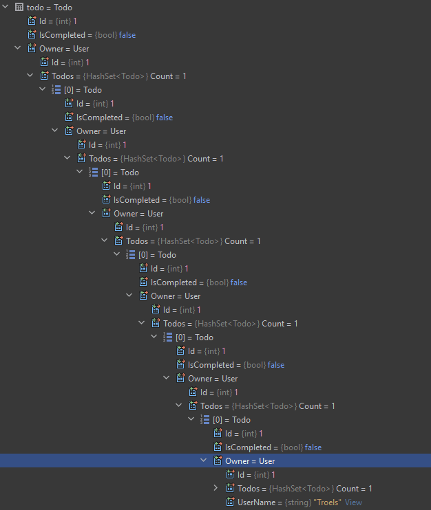

# Complete Todo

This was actually "update todo". I.e. we could update more properties than just the IsCompleted. That part was handled by the Logic layer.

We need two methods in TodoEfcDao: UpdateAsync and GetByIdAsync.


## GetByIdAsync()

This should be straight forward. Remember to load the Owner as well.

<details>
<summary>hint</summary>

```csharp
public async Task<Todo?> GetByIdAsync(int todoId)
{
    Todo? found = await context.Todos
        .Include(todo => todo.Owner)
        .SingleOrDefaultAsync(todo => todo.Id == todoId);
    return found;
}
```

</details>

## UpdateAsync()

In the FileContext, we would remove, then add a Todo.\
The DbSet has an Update method, which will search for an existing object with the same Id, and just overwrite the data.

There is a detail to discuss, here's the method:

```csharp
public async Task UpdateAsync(Todo todo)
{
    context.ChangeTracker.Clear();
    context.Todos.Update(todo);
    await context.SaveChangesAsync();
}
```

I assume the last two statements make sense, but what is the first about? 

#### What is the ChangeTracker?

Your DbContext subclass has a kind of _cache_, i.e. the ChangeTracker. 
It keeps previously loaded objects in memory. It keeps added objects, or tracks that objects are removed or updated. It tracks changes.\
When the SaveChanges is called, everything in the ChangeTracker is submitted to the database in a transaction.\
This is the "Unit of Work" design pattern.

If you fetch an object from the database twice in a row, the first time it will be retrieved from the database. It is then held in memory, in the ChangeTracker.\
But the second time, the object already exists in memory, so that is returned instead of contacting the database.

When doing this update, the above `GetByIdAsync()` is called, fetching a Todo and caching it, i.e. keeping it in memory.\
Then the `UpdateAsync()` is called, and the `Update()` call tries to retrieve a Todo by the argument `todo`'s Id. But this is the same Todo that we just fetched before.\
It will result in an exception that we are trying to keep the same object twice in the ChangeTracker.

The simple way around this is just to clear the cache, as is done above.\
Alternatively we could fetch the Todo again (now from the cache), update the properties, indicate the Todo has been modified, and then save the changes.\
This would, however, move the "update logic", i.e. which properties to update, to the Data layer. Currently that is in the Logic layer.

There may be a middle-ish way too, which I don't know about.

###### Alternative to clear
The problem above is because we first found a Todo by ID, and kept it in the ChangeTracker.\
However, we can also specify that we want to fetch the Todo, without keeping it in the ChangeTracker. 
Then we would not need to clear it. [This article explains how](https://learn.microsoft.com/en-us/ef/core/querying/tracking#no-tracking-queries).

###### A subtle bug
With the above `UpdateAsync()` method, there is a bug, discovered by an unlucky student: 
You cannot update a Todo where you re-assign it the its current Owner.\
If a Todo is currently assigned to Owner with ID 1, you cannot make an update request, where you assign the Todo to Owner with ID 1.

This is again the ChangeTracker playing tricks on us. The problem is in the `TodoLogic::UpdateAsync()` method. We interact with the database as follows:
1) Get the existing Todo from the DataBase. It is kept in the ChangeTracker
2) Get the new User (which is the currently assigned Owner). The User has a collection of Todos, and because of step 1) there is already a Todo in the ChangeTracker. 
This Todo is then added to the Users collection of Todos, to which the User is assigned.
3) We then attempt to update the Todo. This will:
Attempt to fetch from the DataBase the Todo, but this Todo is also in the ChangeTracker because of the User containing it. We then get a conflict, because the same object cannot exist twice in the ChangeTracker.

The `Clear()` does not fix this particular case, because of step 2, the User contains the Todo. So when we update a Todo, that Todo contains an Owner. 
And that Owner (User) has a list of one Todo, the one were updating, so there's a circular reference going on here, and the two Todos are the same: The one being updated, and the one being referenced from the User.

It's probably a bit confusing. I include below a screenshot of the debug information about the Todo we are about to attempt to update.\
You can see that we are working here with Todo with ID 1 and a User with ID 1. And because of the circular reference, the Todo has a User which has a Todo which has a User which...., the DbContext will attempt to load all of them.



I can keep on expanding the tree forever.

**How do we fix it?**

We don't want the Todo to be kept in the ChangeTracker, when we fetch it the first time. We modify the `TodoEfcDao::GetByIdAsync()` as follows:


```csharp{4}
public async Task<Todo?> GetByIdAsync(int todoId)
{
    Todo? found = await context.Todos
        .AsNoTracking()
        .Include(todo => todo.Owner)
        .SingleOrDefaultAsync(todo => todo.Id == todoId);
    return found;
}
```
Notice line 4, here we indicate that this entity should not be tracked, i.e. it will not be kept in the ChangeTracker.

It seems to generally be recommended to not keep objects in the ChangeTracker if you are not going to do something with them, e.g. Delete or Update.\
So, when we are just retrieving them like this, it seems fair to not cache them in the ChangeTracker.

## Test
.. this by running the Web API, and using the PATCH /Todos endpoint.

See if you can complete a Todo. The "try it out" option in Swagger requires you to fill in all data, so find that through another endpoint or the Database tool in Rider.\
Verify result either through Database tool, or another endpoint.

See if you can update a Title.

See if you can re-assign a Todo to a different User.