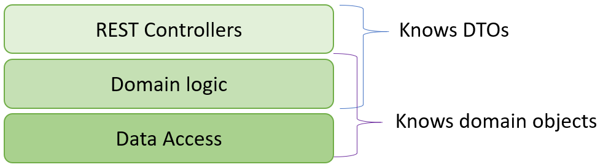
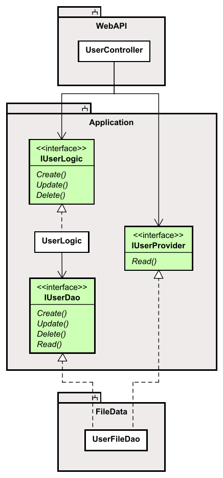
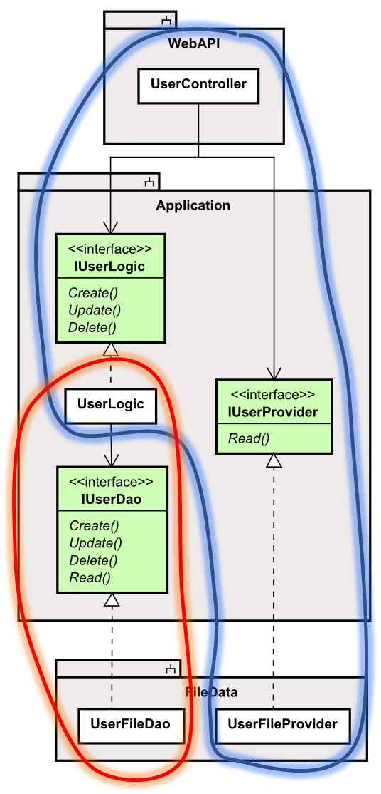

# The End

We have now finished swapping out the File data storage with a different component using EFC.

Mostly, it was pretty painless, we didn't have to modify much in the existing code. There were some unforeseen, unfortunate necessary changes, but I hope you can still see the purpose of the Clean Architecture approach.

So far we have done integration testing, just using the Web API. You should now expand the testing to scenario testing, i.e. use the Blazor app to test whether the swapped out functionality works.

# What did I learn?
I too have learned something along the way. I have actually created this tutorial at least three times now, each time applying knowledge from the previous.
And each learning something I would include in the next version, if I ever get to that. It's comprehensive work.

The clean-architecture approach has taken a lot more focus in this latest version, so that took some focus.
And there are things, which could be done differently

## Domain classes and logic
I would move away from the simple data containers, our domain classes currently are.
Mostly just consisting of get/set properties. 

I would instead remove all set-properties, probably also most get-properties, and create a constructor.
We already have that for the Todo, the intention was to make sure the Todo was
not created in an invalid state, i.e. a Todo cannot be created without Title and Owner.\
That's an okay start, but the data passed to the Todo can still be invalid.

So, in the constructor I would include validation logic, which currently resides in the TodoLogic class.

This way, we separate "Domain logic" from "Use case logic". What's the difference?

### Domain Logic
Domain logic would be to ensure that domain objects are always in a valid state. 
Whenever they are created or modified we need to validate the data.

We would create specific methods to update the data, but not just the normal set-methods.\
I don't want a `SetTitle(...)` method, which only assigns a parameter to the field variable.\
I think `UpdateTitle(..)` is more telling, and the method would validate the argument, and in case of invalid data, e.g. the argument is null/empty, throw an exception.

Or what about the "cannot un-complete a completed Todo?". That logic fits just fine inside the Todo object.\
We would have a `SetCompletedStatus(bool status)` method. We could, and then include a check as we currently have in TodoLogic.\
But what about just making a method `Todo::Complete()`. No arguments. This way there is no way to even attempt to un-complete a completed Todo.

_Make sure a domain object is never in an invalid state after creation or update._ No matter where in the system this happens.

It's similar for the User. We don't have any constructor for a User, meaning a User object can currently be created with no data. That does not make sense.\
I know we only create users in the UserLogic, currently, where they are validated. But as the system grows, User objects might have a need for being created elsewhere.\
We would then again have to include the same User data validation logic in that other place.

Instead, let a domain class be responsible for ensuring its own data integrity.

#### Problems?
Well, sometimes when we load data from the database, we need to be able to set all that data on a Todo (or User), and that is simplest with just set-properties.\
A constructor might not take all the arguments that we need, e.g. currently a Todo accepts `Owner` and `Title`. But the data layer cannot set the `Id` and `IsCompleted` with direct access to those.\
I'm not entirely sure how to get around that. I mean, with EFC we could include private set-properties and private constructor.\
But if we used manual SQL to interact with the database, I'm not sure. This calls for further investigation. Maybe a question to reddit.

### Use case logic
Often Clean-architecture will call the application layer for "use case" layer. 
That means this is where the logic is for e.g. "Creating a Todo" happens. Or "Update a Todo". 
Or "Re-assign/update a Todo". I.e. our user stories start in this layer. 
Just like we first implemented the Logic layer, when we did each user story, i.e. Domain Driven Development. Then the other two layers, Web API and Data access.

Some logic cannot be done inside the domain class. 
E.g. if I were to create a new User object, the User would be responsible for making sure the 
UserName was valid, in the sense of "not null" or "not empty", or "more than 3 characters long".

But the User class cannot check whether the UserName is already taken. That must be the responsibility of the UserLogic class checking that, because it requires interaction with the data layer.

If I create a new Todo, the Todo can check various internal data. But the Todo cannot verify that the intended Owner actually exists. That is then done in the Logic layer.

If we need to update a Todo that method currently works like this:

1) Fetch existing Todo from data layer
2) Check it exists
3) Fetch the new owner
4) Check the owner exists
5) Check we are not un-completing a completed Todo
6) Update data in the fetched Todo
7) Validate the updated Todo
8) Save the updated Todo

Some of these steps can be handled by the Todo class itself, e.g. steps 5, and 7.\
And step 7 also happens in the method for create new Todo. So, there is some overlap.

The other steps are then "use case logic", executing things, binding things together, etc.

So, let's separate use case logic from domain logic.

## Where to use Domain classes, where to use DTOs

Previously I attempted a guide line for which layers should know about domain classes, and which should know about DTOs.
Slide 11 in Part 1 of the series. I showed this image:

And I realize I didn't follow that exactly, fx the Web API for getting Todos would actually return the Domain object.\
That caused problems because the Todo could not be JSON-Serialized due to a circular association between Todo and User.

Instead, we should have returned a new kind of DTO, e.g. `TodoListDto`.

I would attempt the suggestion of CQRS from part 1, separating reading actions from create, update, delete.

It would look like this:

Most use case logic would happen in the "left lane", i.e. go through UserLogic. Notice the `IUserLogic` interface can create, delete, update. But not read.\
These three methods would receive specialized DTOs, the `UserLogic` would figure out what to do, and use the `IUserDao` interface to interact with the data layer.\
This interface, `IUserDao`, will receive and return domain objects. No DTOs here.\
Notice the `IUserDao` interface has a read method. Sometimes we need to retrieve domain objects, e.g. when we set an owner on a Todo, we first retrieve the User domain object.

Now, the `IUserProvider` interface only provides read methods, but potentially multiple of them, specialized.\
If you want to display a specific User in the UI, this interface can return a DTO for that.\
If you want to show a User with all their Todos, this interface can return a DTO for that.\
If you want to show a list of just user names, this interface can return a DTO for that.

We might even create a separate implementation for the `IUserProvider` interface, i.e. a `UserFileProvider`.

In the end, the classes/interfaces who knows about domain objects or DTOs are:
* Domain objects
  * UserLogic
  * IUserDao
  * UserFileDao
* DTOs
  * IUserLogic
  * UserLogic
  * IUserProvider
  * UserFileDao (or a separate UserFileProvider)

Or in a diagram, blue area is DTO territory, and red is Domain Class territory:

We are keeping things separate, and it is easier to avoid mixing things up, where sometimes the Web API returns domain objects, and other times it returns DTOs.

I had some of these ideas from the beginning, some of them popped up along the way. I had to make a cut somewhere, what to include in the tutorial, and what not to.\
It can be perfectly fine, to just have "stupid" domain classes, no constructors, all `{get;set;}` properties. That is probably the simple approach. You can even do without any DTOs at all. And that's fair.

Some of the above thoughts, are thoughts only. I have not tried them out yet. Maybe when I do, I figure out something really does not work, as I wanted it to.

Mostly, I just want you to think about things. Make informed, well-considered choices. Try different things.