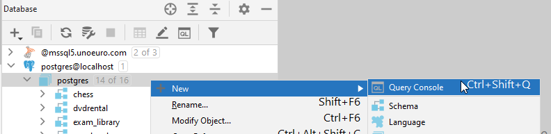

more s# Creating a schema
In the console, we will start by creating a schema.

Schemas are used similar to packages in Java, it's a way to organize your database.\
Create a database schema by entering `CREATE SCHEMA starcompany;` in a console window. If you don't have a console tab open, you can rightclick the "postgres" in the hierarchy on the left, and select "new", then "query console":

Select the statement, press the 'Execute' button (green arrow), or by <kbd>ctrl</kbd> + <kbd>enter</kbd>. You can see a thin green rectangle around the statement you are about to execute.

Open Schemas in the browser to the left to see the change. A StarCompany schema should appear under the Schemas section.

###### Note
The hierarchy structure may look a bit different for you. Maybe you don't have a "schemas" folder, and then your starcompany is just under "postgres". That's not a problem.

### Setting the schema
In the above screenshot, in the top-right-ish corner, you can see "postgres.public". This means everything executed in the console is done against the `public` schema. If we create a new table, it happens in the public schema.\
We want to work in the `starcompany` schema:

Execute the command `SET SCHEMA 'starcompany';` by writing the command in the console, selecting it and pressing the execute button. This sets StarCompany as the current schema.

The effect of this is that everything we subsequently execute will be executed against this schema.

### A note about lower casing
Notice how postgresql lower cases all your names, for schemas, tables, attributes/columns. Nothing we can do about that.

### A note about upper casing
Also notice, how some _keywords_ in sql are all uppercase, like `SET SCHEMA` or `CREATE SCHEMA`.\
This is not strictly required, but just an old convention to improve readability that people generally still follow. 
Nowadays your IDE will syntax highlight your SQL, e.g. in the above screenshots SQL keywords are orange. 