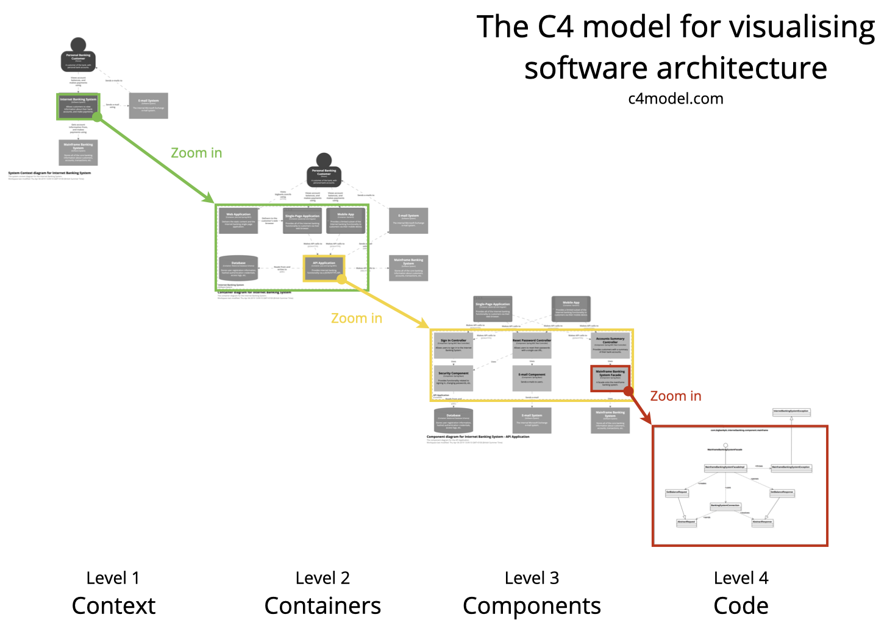

# Introduction

The purpose of this article is to give you inspiration how to document the design of your system.

Throughout many semester projects I have seen students being unsure which diagrams are needed, how to do them, where to put them. Basically, how best to explain how your system is put together.

This article takes heavy inspiration from the [C4 model for visualising software architecture](https://c4model.com/), but I have adjusted certain things, to make it fit better to our projects. The overall idea is the same, though.

The point is that you can create diagrams of your system at different levels of abstraction. \
Consider the class diagram, it is detailed, but may become very large and incomprehensive, if you don't have some prior understanding of where to start looking at the diagram.\
Here, different abstractions, and conventions, can really help the reader.

Instead of presenting the class diagram first, it is better to first give the reader a high level overview of the system. Is it a single-user desktop app? Is it client-server? Are there multiple servers?

So, different levels display different relevant information about the system. Usually it is best to start at high levels, zoomed out, and then gradually zoom in with more detailed diagrams.

This article will give examples of the various levels.

## C4 Real Quick

The C4 model is named so, because it contains four types of diagrams, at four levels of abstraction:
* Context
* Containers
* Components
* Code

I realize you can't read the text, but the point remains: You have four levels, and can gradually zoom in, using different diagrams.

### 1 Context

This is the highest abstraction, it is sort of like a domain model, or a rich picture.\
It provides a starting point, showing how the software system in scope fits into the world around it.

### 2 Container

This diagram zooms into the software system in scope, showing the high-level technical building blocks.\
Here you will find the various applications and data stores. E.g. in a client-server system, this diagram would show client, server, and data, with connections between them.

### 3 Component

Applications are often composed of multiple components. We don't practice this very much at VIA, but a component can be considered a module in Java (or a JAR file), and a project in C# (or exe or dll file).

### 4 Code

This is your class diagram. Either one large, or by application (client, server, etc). Sometimes by component, but then you do risk the diagram becoming too fragmented to provide value.

Often this diagram is the one, which changes most often, and will involve the most work to keep updated.