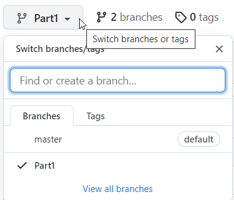

# Introduction

This tutorial will initially introduce you to Blazor-server. You will create a web app to manage todo items. You can consider it a very simple Trello clone.

You will create basic features, such as 
* creating a Todo
* viewing all
* searching
* modifying
* deleting

Initially the data will be saved in a file, as json format.

In later sessions, we will expand upon the tutorial, changing it to a client server system using REST, and lastly adding a real database, using Entity Framework Core (EFC).

The entire collection of Todo tutorials aim to perfectly prepare you for the exam.

All source code will be on GitHub, so you always have a reference, if you're stuck.  
**[Find it here on GitHub](https://github.com/TroelsMortensen/BlazorTodoApp/tree/Part1)**

Different parts of the tutorial in the future, will be in different branches:

