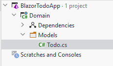

# Todo model class
You can start by deleting the default class that comes with the project: Class1.cs.

Inside your Domain project, create a new directory, name it Models. In here we put the model classes.

Create a new class, call it `Todo`:



The `Todo` class needs properties for the data, a Todo should hold:

```csharp
public class Todo
{
    public int Id { get; set; }
    public int OwnerId { get; set; }
    public string Title { get; set; }
    public bool IsCompleted { get; set; }

    public Todo(int ownerId, string title)
    {
        OwnerId = ownerId;
        Title = title;
    }
}
```

We have created a constructor, which only takes two of the four properties as arguments. The intention is that the Id should be set automatically by whatever class persists the data, and you cannot create a Todo, which is initially already completed, so we just default `IsCompleted` to `false`, by not setting it.

We might consider adding a feature of reassigning todos to other users. At a later point.