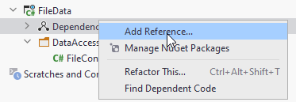
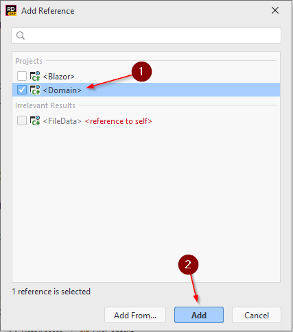

# File data component
Create a new project again, this time a library:

Again, delete the Class1.cs.

We then need to add dependencies to other components, so that the FileData component can use classes from other components.
Inside the FileData component, right-click the Dependencies:

Then select the Domain component ((1)), and click Add ((2)).

This means your FileData component can now access namespaces and classes in the Domain component.