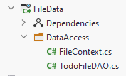

# Data Access Object

We currently only have one type of domain object, so we just need a single DAO to provide CRUD operations on Todos.

The finished class is found [here](https://github.com/TroelsMortensen/BlazorTodoApp/blob/Part1/FileData/DataAccess/TodoFileDAO.cs).

This DAO should be located in the FileData component, either put it in the DataAccess directory or create a new.



This class should implement the `ITodoHome` interface from the Domain component, and provide implementations for the
methods.

First, we need a FileContext. We will just get and assign this in the constructor:

```csharp
public class TodoFileDAO : ITodoService
{
    private FileContext fileContext;

    public TodoFileDAO(FileContext fileContext)
    {
        this.fileContext = fileContext;
    }
    
    // ...
```

We use constructor dependency injection for the FileContext, so we don't have to manually create a new instance. This is
generally a good approach. Remember SDJ2 and MVVM:
Controllers, VMs, and Models got what they needed through constructors. We will get the framework to handle this dependency
injection for us.

### Getting all todos
We'll start with the `GetAsync()` method:
```csharp
public async Task<ICollection<Todo>> GetAsync()
{
    ICollection<Todo> todos = fileContext.Todos;
    return todos;
}
```
Here we just retrieve the `Todos` from the `fileContext`, and return the collection. The method is marked `async`, even though we don't have any asynchronous code here.
This is future proofing, because when we change to retrieving data from a server, that will be asynchronous.

### Get todo by id
This method should return a Todo by its id:
```csharp
public async Task<Todo> GetById(int id)
{
    return fileContext.Todos.First(t => t.Id == id);
}
```
The `First()` method takes a predicate and returns the first Todo, which matches the criteria. We know the Id is unique, so there should be no problems here.

### Add Todo
In this method we need to implement the functionality of auto-setting the Id of the provided Todo item. The method looks like this:
```csharp
public async Task<Todo> AddAsync(Todo todo)
{
    int largestId = fileContext.Todos.Max(t => t.Id);
    int nextId = largestId + 1;
    todo.Id = nextId;
    fileContext.Todos.Add(todo);
    fileContext.SaveChanges();
    return todo;
}
```
First, we use the `Max(...)` method to find the largest value of Id in the collection.  
Then we create the new Id, by incrementing the current largest Id by 1.  
We assign that Id to the provided `todo`.  
We add the `todo` to the `fileContext`.  
We call `SaveChanges()` so that the Todos are written to the file.  
Finally, we return the finalized todo object, now with a correct Id, in case it is needed.


### The other methods
Give the other methods a try on your own, and look up the [solution on GitHub](https://github.com/TroelsMortensen/BlazorTodoApp/blob/Part1/FileData/DataAccess/TodoFileDAO.cs) if needed.

DeleteAsync: Remove a todo from the collection of todos, based on the given id, in the `fileContext`, remember to call `SaveChangesAsync`

UpdateAsync: First find the existing Todo, by using `todo.Id`. Take the `OwnerId` and `IsCompleted` from the argument, and overwrite the values of the Todo from the `fileContext`. Then call `SaveChanges()`
