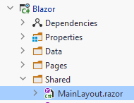
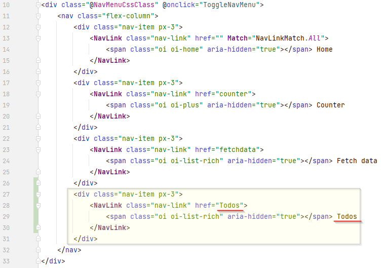
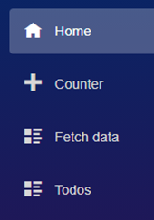
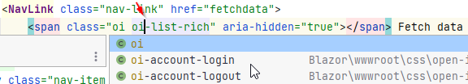

# Navigate to todos overview

### Changing layout
The default blazor app comes with the left side navigation bar. For this tutorial, we will just expand on that. You can, however, rework the entire layout of the app at a later point, if you wish.
This is done in the file `MainLayout.razor`



In this file you can see a bit of html, which define the layout. You will also notice the `<NavMenu/>`, which is a reference to the NavMenu component, the look and functionality of which, is defined in the NavMenu.razor file. The NavMenu is a component, i.e. a piece of UI, which can be inserted into other pages or components. 
It can be very beneficial to organize UI pieces into components for re-usability.

In MainLayout.razor you will also notice `@Body`. This must always be present, if you start reworking the layout. This variable will be replaced with whatever page you open.

### Adding to NavMenu
Open the NavMenu.razor:


As mentioned, this defines the left hand side navigation menu. We want to add a new menu item, so we can open the Todos overview.

Inside NavMenu, locate the following piece of html:
```razor
<div class="@NavMenuCssClass" @onclick="ToggleNavMenu">
    <nav class="flex-column">
        <div class="nav-item px-3">
            <NavLink class="nav-link" href="" Match="NavLinkMatch.All">
                <span class="oi oi-home" aria-hidden="true"></span> Home
            </NavLink>
        </div>
        <div class="nav-item px-3">
            <NavLink class="nav-link" href="counter">
                <span class="oi oi-plus" aria-hidden="true"></span> Counter
            </NavLink>
        </div>
        <div class="nav-item px-3">
            <NavLink class="nav-link" href="fetchdata">
                <span class="oi oi-list-rich" aria-hidden="true"></span> Fetch data
            </NavLink>
        </div>
    </nav>
</div>
```
The divs marked with `class=nav-item px-3` each contain a nav menu item. Duplicate the last one and modify it like this:



The class `oi-list-rich` is the icon:



You can find more included icons [here](https://iconify.design/icon-sets/oi/) and [here](https://useiconic.com/open). 

Rider is also pretty good at auto completing html. E.g. for more icons place your cursor here:



And press <kbd>ctrl</kbd> + <kbd>space</kbd>, assuming default IntelliJ Keymapping.

Addiditionally, you can click on an html tag (or in general just about anything) and press <kbd>ctrl</kbd>+<kbd>q</kbd> to get more information about something, a class, a tag, a method, a variable.

