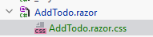
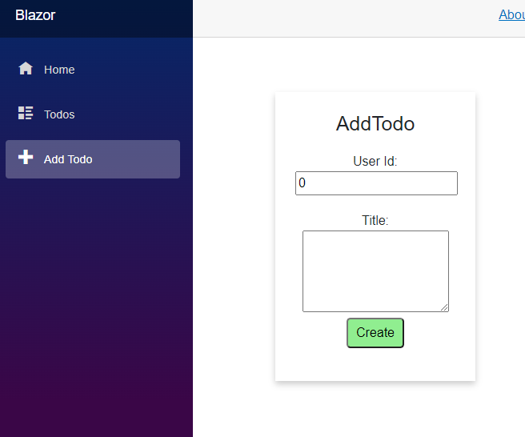

# Add todo styling

Currently, when you open the Add Todo page, it should look something like this:


If you are happy with that, you can skip to the next slide. You can also apply some styling of your own.

Or use the styling explained below.


### Style behind
First, add a style behind:



In this file, put the following css:

```css
.box {
    box-shadow: 0 4px 8px 0 rgba(0,0,0,0.2);
    transition: 0.3s;
    width: 250px;
    padding: 25px;
    text-align: center;
    margin: auto;
    margin-top: 50px;
}

.field {
    margin-top: 20px;
}

.acceptbtn {
    background-color:lightgreen;
    border-radius: 5px;
    padding: 5px;
    padding-left: 10px;
    padding-right: 10px;
}

.acceptbtn:hover {
    background-color: #00d900;
}
```

### View modifications
Then we need to add the styles to the view part of the page.


Surround everything with a `<div>` with the class "box".\
The divs inside need the "field" class.\
The button gets the "acceptbtn" class.\
The `errorLabel` is only shown, if it is not empty. Otherwise, it may take up some whitespace.

### Result

Your page should now look like this:



With the box centered in the view.