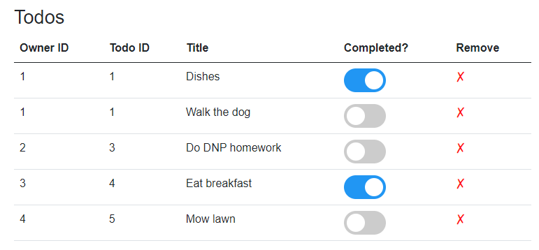

# Toggling the completed status

Sometimes it is a bit of a crude solution to just delete a Todo, and you do actually have to finish the task.
The good part though, is that you to mark that task as completed. 

This next step will introduce that feature.

We need to modify the `Todos.razor` file again, so that also means the solution to the following feature is in a new branch [here](https://github.com/TroelsMortensen/BlazorTodoApp/tree/3ToggleStatusFeature).

We are aiming for this view:



### Code block
First, a method to be called, whenever the _completed_ status of a Todo is changed. We add that to the codeblock:

```razor
private async Task ToggleStatus(bool status, Todo todo)
{
    errorLabel = "";            
    todo.IsCompleted = status;
    try
    {
        await TodoHome.UpdateAsync(todo);
    }
    catch (Exception e)
    {
        errorLabel = e.Message;
    }
}
```

This method takes a boolean and a `Todo`, and assigns the boolean as the `IsCompleted` of that `Todo`.\
The method is asynchronous, so we can await the call to `TodoHome`.

### The view

We need to update the "Completed?" column to hold a new toggle button. Update the table-for-loop as follows, notice the highlighted lines 7-14:

```razor{7-14}
@foreach (var item in todos)
{
    <tr>
        <td>@item.OwnerId</td>
        <td>@item.Id</td>
        <td>@item.Title</td>
        <td>
            <label class="switch">
                <input type="checkbox" 
                    checked=@item.IsCompleted 
                    @onchange="@((arg) => ToggleStatus((bool)arg.Value, item))">
                <span class="slider round"></span>
            </label>
        </td>
        <td>
            <label @onclick="@(() => RemoveTodo(item.Id))" style="cursor:pointer; color: red; font-weight: bold">
                &#x2717;
            </label>
        </td>
    </tr>
}
```

It is a bit more html than is strictly needed, we could have made do with just the `<input>` tag, but I wanted to style it a little afterwards. See sub-section below.

There is a `<label>` and `<span>` just for some styling.

The interesting part happens in the `<input>` tag. We set the `checked` attribute of the `<input>` tag to be the value of the `todo` item with `=@item.IsCompleted`.\
We add an `@onchange` handler, a lambda expression, here taking an argument `arg`, which is a `ChangeEventArgs`, containing information about what changed. In this case the new boolean value.
Then the `ToggleStatus()` method is called, passing along the boolean value and which `Todo` item should be updated.


### Style behind
The above view should just give you a simple checkbox. That can be fine, the functionality should work. 

If you want a toggle like the ones shown in the top screenshot, you can add the following styling:

```css
.switch {
    position: relative;
    display: inline-block;
    width: 60px;
    height: 34px;
}

.switch input {
    opacity: 0;
    width: 0;
    height: 0;
}

.slider {
    position: absolute;
    cursor: pointer;
    top: 0;
    left: 0;
    right: 0;
    bottom: 0;
    background-color: #ccc;
    -webkit-transition: .4s;
    transition: .4s;
}

.slider:before {
    position: absolute;
    content: "";
    height: 26px;
    width: 26px;
    left: 4px;
    bottom: 4px;
    background-color: white;
    -webkit-transition: .4s;
    transition: .4s;
}

input:checked + .slider {
    background-color: #2196F3;
}

input:checked + .slider:before {
    -webkit-transform: translateX(26px);
    -ms-transform: translateX(26px);
    transform: translateX(26px);
}

/* Rounded sliders */
.slider.round {
    border-radius: 34px;
}

.slider.round:before {
    border-radius: 50%;
}
```

This was just stolen from an example on [w3schools](https://www.w3schools.com/howto/howto_css_switch.asp).

### Test


Test that the functionality works, by changing the status of a `Todo` and refreshing the page, or opening a different page and go back to the overview again.