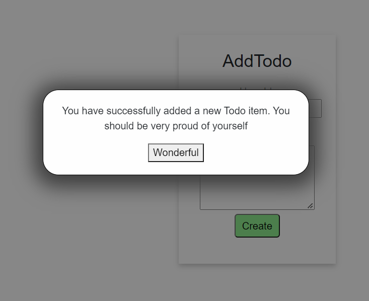

# Popup component

We will continue to play a bit with components, this time we will create a popup to show messages (and other stuff).

There are several libraries, mentioned in step 32, which can do this, but let's start with a manual approach.
There are probably smarter ways to do this, but this approach is also to reiterate how to pass arguments to components.

We can start by using it to show a confirmation message to the user, when a new Todo was added successfully.

The result will look like this:



You may style the button, if you wish.

### Setup
In the UIElements directory, create a new blazor component called `Modal.razor`. 

These kinds of popups have some common names based on how they are shown.\
We will make a modal (or sometimes called toast). 
There is another called snackbar, and probably more variations.
It's good to know, if you need to google for examples.

### Code
The entire component looks like this:

```razor
@namespace UIElements

<div class="modal-background" style="display:block; height: 100%">
    <div class="modal-box">
    
        @ChildContent
    
    </div>
</div>

@code {

    [Parameter]
    public RenderFragment ChildContent { get; set; }

}
```

First, at the very top, we define the namespace.

Next, two nested `<div>` tags to organize everything. 
This piece of html (and css) was taken from an [example found on w3shcools](https://www.w3schools.com/howto/howto_css_modals.asp).

There isn't much here. The component is just a "wrapper", which can take some html content, and show it in a popup.

**Line 6** is important, it defines `@ChildContent`, and this means you can pass html/razor-syntax to a component, by setting the `ChildContent`.
It has to be named like this, and the property must be defined as shown in the code above. How to use it will be shown later.

In the code block, we have one parameter, which will be the content to be shown in the popup.

### Styling
Next up, we need the styling. Add a style-behind. 
Paste in the following:
```css
.modal-background {
    position: fixed; /* Stay in place */
    z-index: 1; /* Sit on top */
    left: 0;
    top: 0;
    width: 100%; /* Full width */
    height: 100%; /* Full height */
    overflow: auto; /* Enable scroll if needed */
    background-color: rgb(0,0,0); /* Fallback color */
    background-color: rgba(0, 0, 0, 0.47); /* Black w/ opacity */
    display:block;
}

/* Modal Content/Box */
.modal-box {
    background-color: #fefefe;
    margin: 15% auto; /* 15% from the top and centered */
    padding: 20px;
    border: 1px solid #000000;
    /*display:inline-block;*/
    width: 30%; /* Could be more or less, depending on screen size */
    min-width: 300px;
    border-radius: 25px;
    box-shadow: 0 5px 30px 15px #3f3f3f;
}
```

That's the basic component. Next up, we need to use it for something.
