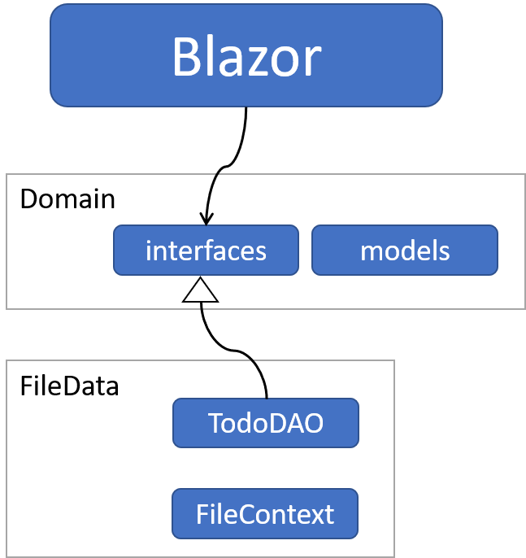
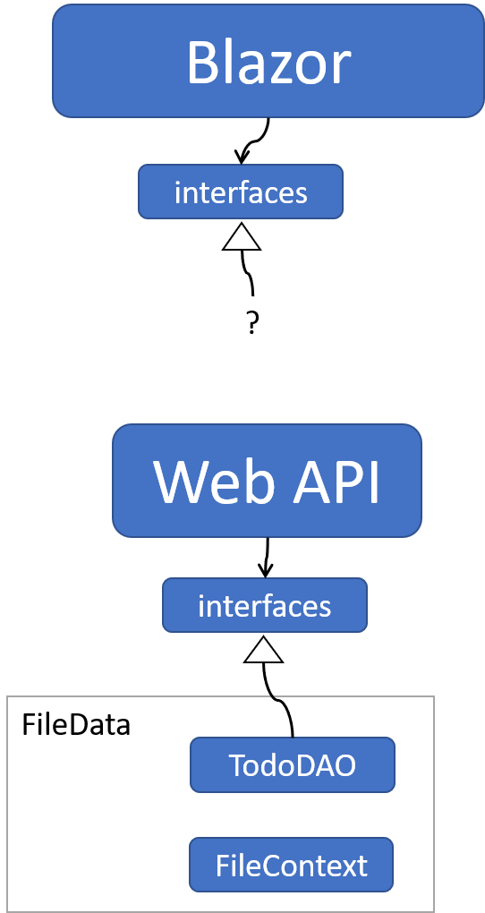

# Architecture

Currently, the Todo app contains three components:
1) Blazor, our UI
2) Domain, which contains interfaces, and model classes
3) FileData, which writes data to a file.

It looks something like this:

What we want to do, is inject a layer of networking between Blazor and FileData.

At the end of this tutorial, it will look like below (notice, there's still no client, which comes later)

Now, it gets a little confusing, how things fit together, so let's just rearrange the components in a layered structure:

Now, notice, that the two interface layers, are the same interfaces: ITodoHome. It's now, still, used by the Blazor app (and will eventually have a web client implementaiton behind), and it's also used by the Web API, where the implementation behind is the TodoFileDAO class.

There is a "?" to indicate we still don't have the client classes yet, which will contact the Web API for data.

So, let's get to it.