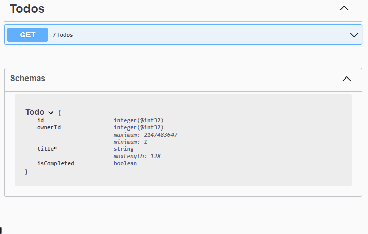

# Testing Your Endpoint

You WebAPI should include Swagger, a tool to test your API.

If you run the project (WebAPI), it should open the Swagger page. You should see this:

First you get an overview of all the endpoints, you can call. This is automatically generated by Swagger, that's pretty neat.

The Schemas box shows the data to send/receive to/from your endpoints. If you expand it, you can see what kind of data your Todo consists of.

Test your GET endpoint like this:

You will be able to see the:
* Request URL: https://localhost:7204/Todos
* The status code: 200, which means "OK"
* The data returned, as JSON

#### Notice
You may have had a bunch of Todo items from the previous tutorial. Now, you will just get the seeded Todos again.

This is because the FileContext is run from WebAPI instead of Blazor project. Therefore, the todos.json file is located in WebAPI instead of Blazor.

