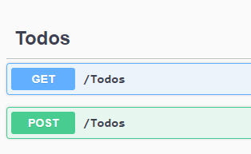
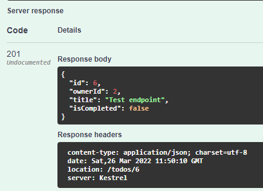
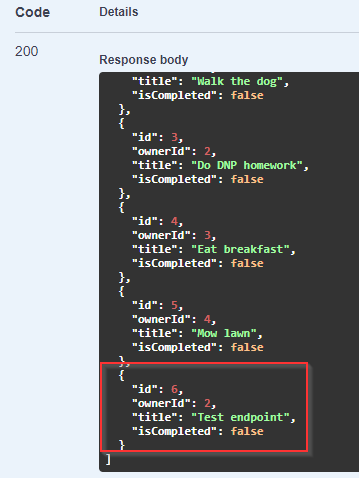

# Test Add Endpoint

Again, we want to test this endpoint. This is done by running the WebAPI project, to open the Swagger page.

This time, you have a new endpoint available:



Expand the POST endpoint, click the <kbd>Try it out</kbd> button on the right side.

This opens a text-area with a default json Todo object:


Here, replace text to be (or something else):

```json
{
  "ownerId": 2,
  "title": "Test endpoint",
  "isCompleted": false
}
```

We don't set the Id of the Todo, as that is the responsibility of the server.

Click the <kbd>Execute</kbd> button.

You should get the following response:



We see the status code is 201. We get the resulting Todo Object, now with id=6, set by the server. We also get a Response Header, containing some meta data about the response data, e.g:
* Encoding is UTF-8
* The date
* The URI to retrieve the new Todo: "/todos/6"

Another test is to now use the GET endpoint, to retrieve all Todos. Among the resulting list of Todos, you should see your new Todo. Give it a go.

You should get a result like this:




