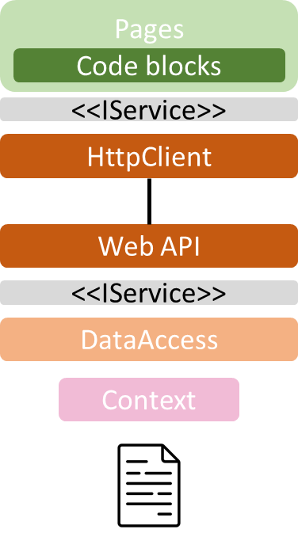
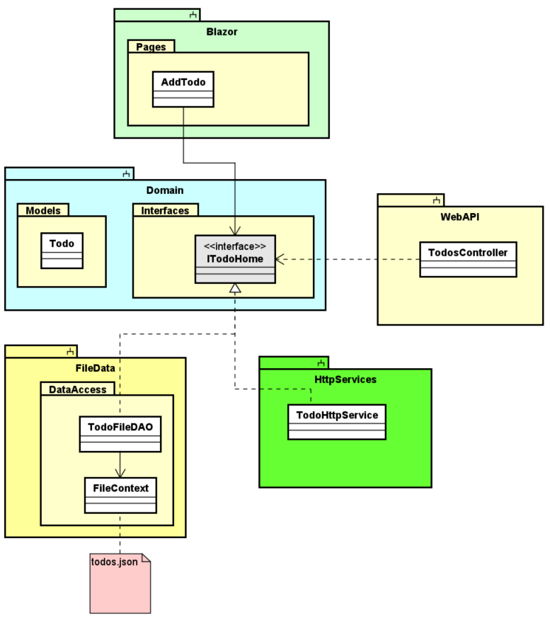

# Introduction

The first part of this series of tutorials had you do a Blazor app. We then, in part 2, made a Web API, which can CRUD Todo items.

In this part, we will make a layer of HttpClients, which the Blazor app can use to retrieve data from the Web API.

The code for this tutorial is found [in this branch](https://github.com/TroelsMortensen/BlazorTodoApp/tree/10HttpClient)

## Layers

After this tutorial, your application will have the following layers:

Notice that `<<IService>>` interfaces are the same in both interface layers. That means, you have an `ITodoHome` interface, which is implemented by both your `TodoFileDAO` class, and a new (not yet created) `TodoClient` class.

We must add a new component to our project, it must be a **Class Library** project. In the below diagram, it is called **HttpServices**.

The above diagram is not complete, it focuses on the components of the application.

