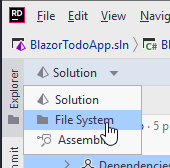

# Initial Setup


## Clean up

The class library comes with a dummy class, `Class1`. Delete it.

If you have both users and todos, you may go ahead and create a directory for each, to contain the HttpClient classes: TodoClients and UserClients.

## Adding Dependencies

1) Your HttpServices component must depend on Domain component, so that we can access the interfaces.
2) The Blazor component must depend on HttpServices.

## Removing Dependencies

This is a bit trickier.

You must switch to File System:



And open up a file in Blazor component: Blazor.csproj.

This is a settings file, containing various information about the project. Among other things:

* Version of .NET
* Whether nullable checks are enabled
* Dependencies

You should see the following block:

```xml{3}
    <ItemGroup>
      <ProjectReference Include="..\Domain\Domain.csproj" />
      <ProjectReference Include="..\FileData\FileData.csproj" />
      <ProjectReference Include="..\HttpServices\HttpServices.csproj" />
    </ItemGroup>
```

We wish to remove dependencies to FileData, so remove the highlighted line. Save. Close file. Switch back to Solution view, see above screenshot.

It is preferable to be strict about dependencies, so you don't by accident use classes you're not supposed to use.

Your Blazor.Program.cs now complains, because it cannot see classes in FileData, which you are adding as services. That is okay, we'll change that shortly.
