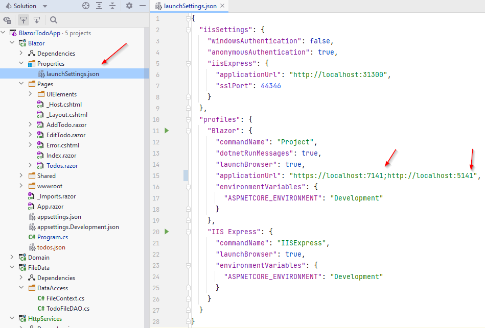
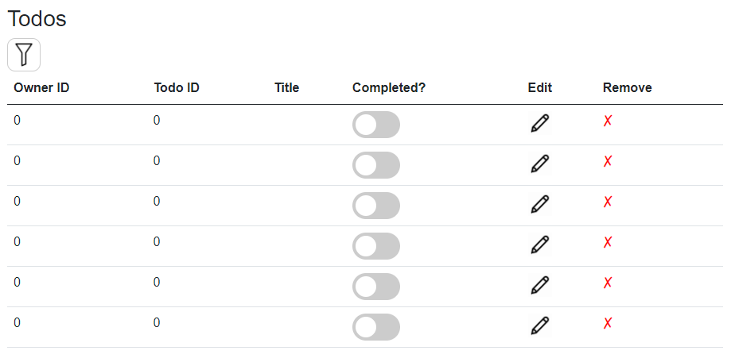

# Testing


## Setup
Now, the URI which your Web API and Blazor app is running on, is sometimes the same. Given the fact that you can only have on process bound to a specific port at a time, if you try to run both, you'll get an error.

We'll need to change the port for one of the programs. Maybe it isn't a problem for you, so you could just try and run both and see if it works. If not, read below:

We'll change Blazor, as we hardcoded the port into the `TodoHttpClient` class.

Navigate to the file "Blazor/Properties/launchSettings.json". This is a configuration file.

There is a profiles section, which contains "Blazor" and "IIS Express". We **NEVER** want to tough IIS Express in this course.

In the Blazor section, there is a setting for the "applicationUrl". Change the ports slightly, in my case they are currently 7140 and 5140, for https and http, respectively. I change them to 7141 and 5141.

Result:



#### Note

You may also notice a setting
```
"launchBroewser": true,
```

If this is set to "false", a new browser tab will not open each time you run the project. Instead, you might click on the URI in the console to open the app. 

I find this useful, because sometimes I'll end up with many duplicate tabs open.

## Test

Now, go ahead and start the Web API, it opens swagger, but you can just close that again.

Next up, start Blazor.

Open the page for viewing all todos, and what do we see? I get this:



So, that looks iffy. I do get a number of rows equal to the number of Todos I have in my file. But no data.

## The Fix

This is because a .NET Web API returns json formatted with `camelCase`, like so:

```json
[
  {
    "id": 1,
    "ownerId": 1,
    "title": "Dishes",
    "isCompleted": false
  },
  {
    "id": 1,
    "ownerId": 1,
    "title": "Walk the dog",
    "isCompleted": false
  }
]
```

Notice the attribute names are starting with lower case.

However, by default, the JsonSerializer utility class will look for properties with exact matching name, but in C# we use `PascalCase` for naming properties, and the JsonSerializer will not find matches.

To fix this, we need to add an option to the `DeSerialize<>()` method, like so:

```csharp{12-15}
public async Task<ICollection<Todo>> GetAsync()
{
    using HttpClient client = new ();
    HttpResponseMessage response = await client.GetAsync("https://localhost:7204/todos");
    string content = await response.Content.ReadAsStringAsync();

    if (!response.IsSuccessStatusCode)
    {
        throw new Exception($"Error: {response.StatusCode}, {content}");
    }

    ICollection<Todo> todos = JsonSerializer.Deserialize<ICollection<Todo>>(content, new JsonSerializerOptions
    {
        PropertyNameCaseInsensitive = true
    })!;
    return todos;
}
```

Test again, it should work now. This is also relevant when sending JSON between C# and Java. 