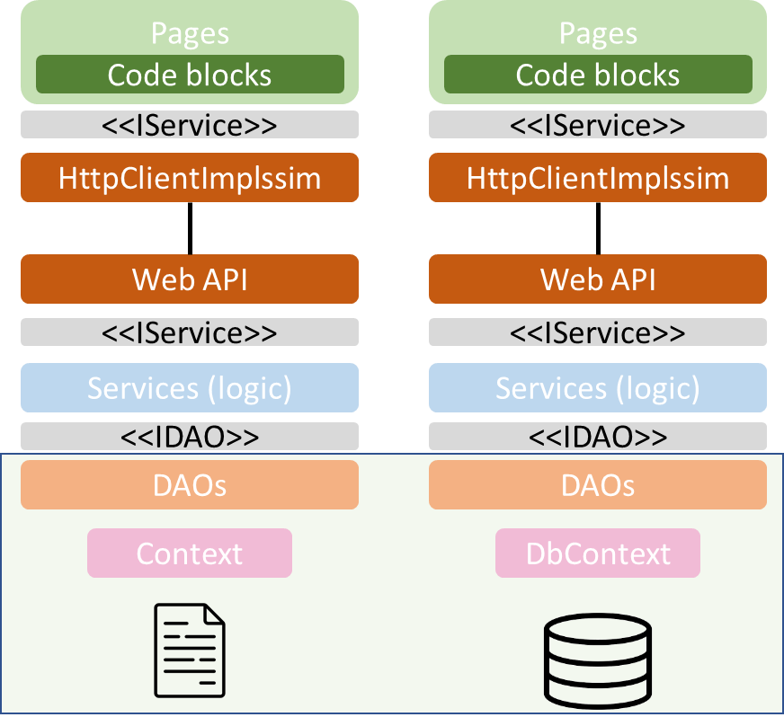
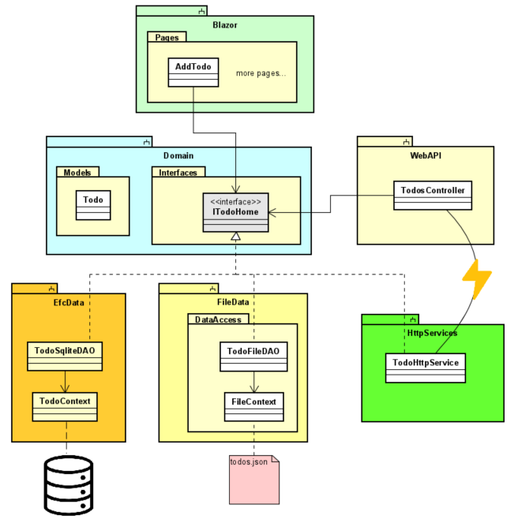

# Introduction

In this tutorial we will add Entity Framework Core (henceforth "EFC") with SQLite as the data storage, instead of the json-file storage system currently in use.

Below is the layered diagram, you should be familiar with it by now.

To the left, is your current project. The right side version is the result of this tutorial

We will be working within the green box at the bottom, i.e. we are swapping out the data access layer. 

Because of the IDAO interfaces (or whatever you've called them), we should not have to touch anything above.

The current data access is isolated in a component, and the new data access will be in another component. To keep things nicely organized.

Here's another rough overview:

The line-with-lightning between TodosController and TodoHttpService is to indicate networked communication between the two.

The result of this tutorial is found [here on GitHub](https://github.com/TroelsMortensen/BlazorTodoApp/tree/11EFC).