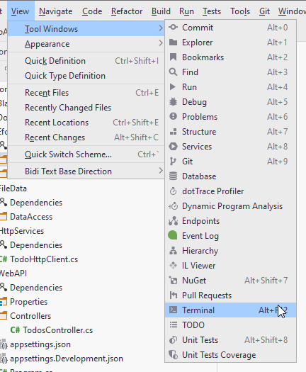

# Installing Tools

You will need to install a command line interface tool, which is used when creating/updating the database.

Open the terminal in Rider:



In the terminal type (it shouldn't matter which directory, you're in):

```
dotnet tool install -g dotnet-ef
```


This will install the db tools. The `-g` means it is a global installation, so all future solutions should also have this tool installed.

