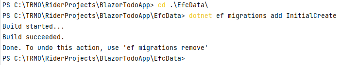
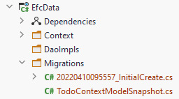

# Migrations

Migrations are updates to the database. The first migration will create the database, and sub-sequence migrations will modify it, either add to or remove from the struture.

A migration is generated based on the DbContext subclass, i.e. your TodoContext. When you create a migration, the database tool (installed in step 4) will look at the DbSets defined, as well as the `OnModelCreating()` method, and generate code, which will alter the database.

Along with the migration, a snapshot is maintained, which keeps track of which migrations have been applied to the database. When updating the database, un-applied migrations will be applied.


## Creating a migration

A migration is created through the terminal (or command line interface).

Open the terminal. 

Navigate to the EfcData project. Most likely when you open the terminal, it is located in the solution directory. You want to enter the EfcData directory: 
```
cd EfcData
```

Once there, type in the following:

```
dotnet ef migrations add InitialCreate
```

The last part, `InitialCreate`, is the name for the migration we are about to create. You should generally call it something, which indicates what this migration does, e.g. UserEntityAdded or TodoEntityUpdated or something similar. Migrations are sort of a form of version control, similar to how you use Git.

Execute the above command.




#### Other commands
Notice how you are informed that you can remove the latest migration (if it hasn't been applied), with the command `ef migrations remove`. 

If you have applied a migration, it can be rolled back. You'll have to google this, if/when you need it.

## Migration Created

The first time a migration is created, a new directory will appear, "Migrations".



Each new migration will result in a new file, the name of which is a time-stamp and the name you provided.

You may open the file to inspect the result, but generally you don't need to touch these migration classes. For example, you can find a constraint, which indicates the primary key of the Todo table. You can also see constraints on the columns, provided by the attributes in the Todo class.

Notice also the `TodoContextModelSnapshot.cs`, which keeps track of which migrations have been added to the database. Currently that is none.

#### Deleting the Migrations

Sometimes, you may want a "hard reset", if you somehow mess up. You can delete the Migrations folder, along with the database file generated on the next slide, and start over.