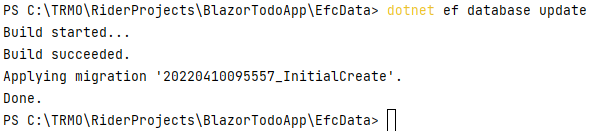
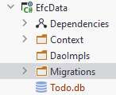

# Apply a Migration

The next step is to apply the migration to your database. Currently we have no database, so it will be created.

Again, in the terminal, and in the EfcData directory, we use the following command:

```
dotnet ef database update
```



In your EfcData project, you should now be able to see a new file, `Todo.db`, with a little database icon. If not, you may need to collapse and expand the EfcData project, i.e. click the little arrow next to the project. This will make it reload the content.



This `Todo.db` file is the Sqlite database. It's just a single file.

