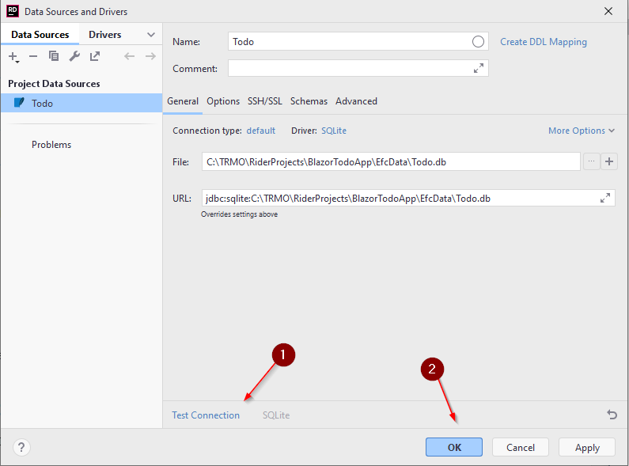
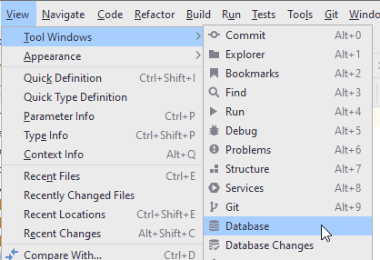
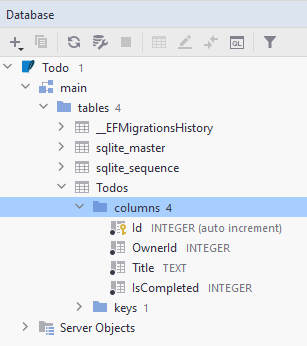

# Inspecting the Database

Rider has a built-in mini-version of DataGrip. If you double click the Todo.db file, you should see a wizard for adding a database source.

You can test the connection, to make sure the information is correct ((1)). If this is your first time, you may not have the Sqlite drivers installed, and you should instead see a link to do so.

When clicking <kbd>OK</kbd>, it should open the Database window in Rider. This can also be found on the right side menu bar, or here:

In the Database window, you get something similar to DataGrip, where you can inspect your database:

You can also double click on tables, to see their content, if you want to verify changes made to the data in the tables.