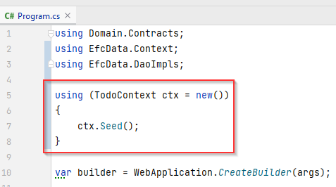

# Seeding

Currently we don't have any data to work with. So, similarly to the FileContext, we wish to seed the database with some dummy test data, if there is no data.

We add a seeding method to TodoContext, and call it from WebAPI.Program.cs.

## Seed Method

In the `TodoContext` add the following method:

```csharp
public void Seed()
{
    if (Todos.Any()) return;

    Todo[] ts =
    {
        new Todo(1, "Dishes"),
        new Todo(1, "Walk the dog"),
        new Todo(2, "Do DNP homework"),
        new Todo(3, "Eat breakfast"),
        new Todo(4, "Mow lawn"),
    };
    Todos.AddRange(ts);
    SaveChanges();
}
```

If the Todos DbSet contains anything, we just return, i.e. do nothing.\
Otherwise we create a list of `Todo` items, add them to the `Todos` DbSet and save the changes. The method `AddRange(..)` just takes some kind of collection, and adds all elements.

When calling `SaveChanges()`, whatever you've done to your DbSets, e.g. added, updated, removed, etc, those changes will be applied to the database, _in one transaction_.

So, it is a bit similar to what we have previously done with the FileContext::SaveChanges method, which also persisted changes made.

## Seed the Db

In the Program class of WebAPI, we need to call the above method. It looks like this:



Here, we use a "using block", meaning that the ctx variable is disposed at the last " } ".

The first time we run the Web API, the database will be seeding. On subsequent runs, there is already data present, so nothing happens.