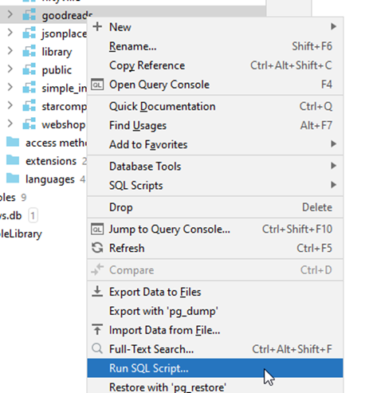
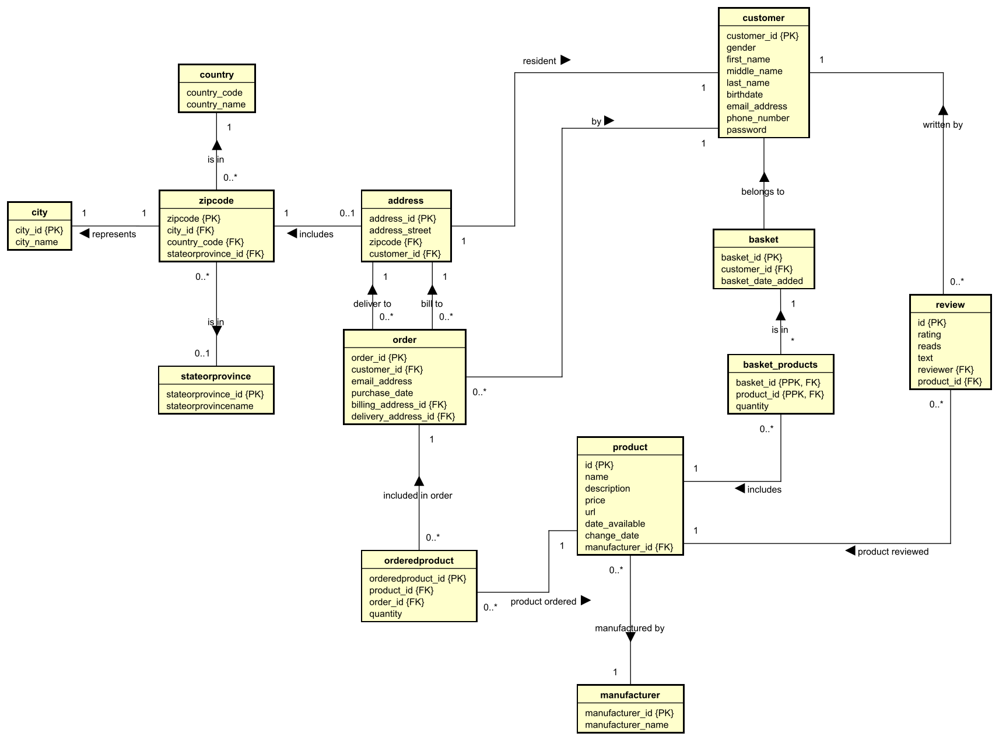

# Webshop SQL Exercises

First exercise is to get the necessary data set up.

If you don't have the webshop schema with data, you first need to download the files, create the schema and tables, then import the data.

Download first the dll file here:

[webshop dll](webshop_DDL.sql)

You must import this by running the ddl code, like this:

Right click on your _schema_ folder, and select the "Run SQL Script...".

This should import a new schema, the dvd rental.

Then, download the data from here:

[webshop data](webshop_data.sql)

Import the data the same way.

Verify you now have a webshop schema, with tables, and data in the tables.

A Global Relations diagram for the schema is shown below:

You may want to right-click and open in a new tab, to increase the size, or download.

Over the following slides, you will be asked questions, which must be answered by querying the dvdrental database.
All questions can be answered with a single sql statement (consider this a challange), but sometimes it is easier to do multiple statements.

For most questions, you can also find the an/swer as a hint. Do give it a serious try first, before you look at the answer. Some of these questions are tough, and you need to google for extra SQL "tools".