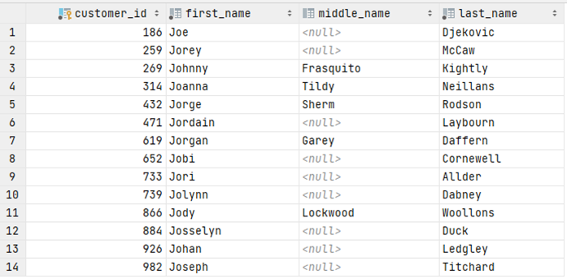

# Exercise 2

Find all customers whose first name starts with 'Jo'. Create a list of id and names.


<details>
<summary>Show answer</summary>



</details>

<br/>

<details>
<summary>Show SQL</summary>

```sql
SELECT customer_id, first_name, middle_name, last_name
FROM customer
WHERE first_name LIKE 'Jo%';
```

</details>