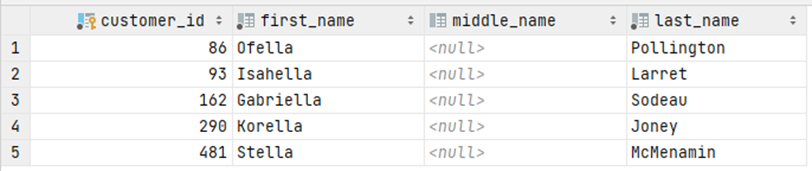

# Exercise 3

Find all customers whose first name contains 'ella' and who does not have a middle name.

Create a list of id and names.

<details>
<summary>Show answer</summary>



</details>

<br/>

<details>
<summary>Show SQL</summary>

```sql
SELECT customer_id, first_name, middle_name, last_name
FROM customer
WHERE first_name LIKE '%ella%'
    AND middle_name ISNULL;
```

</details>