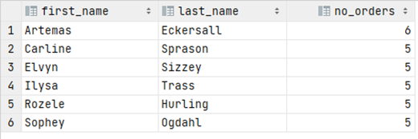

# Exercise 4

Find customers who have ordered mored than 4 items.

Show first name, last name, and the number of ordered items.

Sort by highest count, then first name.

<details>
<summary>Show answer</summary>



</details>

<br/>

<details>
<summary>Show SQL</summary>

```sql
SELECT first_name, last_name, COUNT(*) AS no_orders
FROM customer c,
     "order" o
WHERE c.customer_id = o.customer_id
GROUP BY first_name, last_name
HAVING COUNT(*) > 4
ORDER BY no_orders DESC, first_name;
```

Notice here the "order". This table name is in quotes because _order_ is a keyword in SQL.

</details>