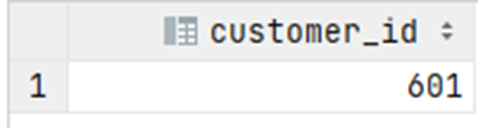

# Exercise 5

Find the customer id of Neysa Aldins (first and last name).

<details>
<summary>Show answer</summary>



</details>

<br/>

<details>
<summary>Show SQL</summary>

```sql
SELECT customer_id
FROM customer
WHERE first_name = 'Neysa'
    AND last_name = 'Aldins';
```

</details>