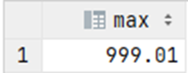

# Exercise 6

What is the price of the most expensive product?

<details>
<summary>Show answer</summary>



</details>

<br/>

<details>
<summary>Show SQL</summary>

```sql
SELECT MAX(product_price)
FROM product;
```

</details>