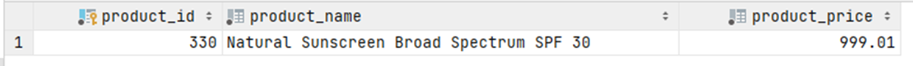

# Exercise 7

Find the most expensive product. 

Display the product_id, product_name, and the price.

You can use your previous answer as a sub-query

<details>
<summary>Show answer</summary>



</details>

<br/>

<details>
<summary>Show SQL</summary>

```sql
SELECT product_id, product_name, product_price
FROM product
WHERE product_price = (
    SELECT MAX(product_price)
    FROM product
);
```

</details>