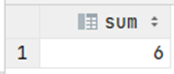

# Exercise 8

Find the sum of the quantity ordered of the most expensive product, 
i.e. how many of the most expensive product have been ordered. 
Again, you may find it useful to use (a slightly modified version) of the previous query as a subquery.

<details>
<summary>Show answer</summary>



</details>

<br/>

<details>
<summary>Show SQL</summary>

```sql
SELECT SUM(quantity)
FROM orderedproduct
WHERE product_id = (
    SELECT product_id
    FROM product
    WHERE product_price = (
        SELECT MAX(product_price)
        FROM product
        )
    );
```

</details>