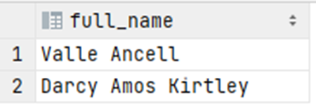

# Exercise 9

Who have ordered the most expensive product? Return their full names as a string, e.g. "Neysa Aldins".

<details>
<summary>Show answer</summary>



</details>

<br/>

<details>
<summary>Show SQL</summary>

```sq
SELECT CONCAT_WS(' ', first_name, middle_name, last_name) AS full_name
FROM    customer c,
        "order" om
        orderedproduct op
WHERE c.customer_id = o.customer_id
AND o.order_id = op.order_id
AND op.product_id = (
    SELECT product_id
    FROM product
    WHERE product_price = (
        SELECT MAX(product_price)
        FROM product
    )
);
```

</details>
