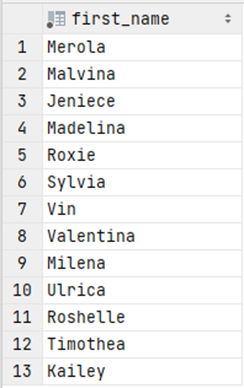

# Exercise 10

Return the first name of all female customers whose last name's second letter is 'o', and who were born in the eighties.

<details>
<summary>Show answer</summary>



</details>

<br/>

<details>
<summary>Show SQL</summary>

```sql
SELECT first_name
FROM customer
WHERE gender = 'F'
    AND last_name LIKE '_o%'
    AND birthdate BETWEEN '1980-01-01' AND '1989-12-31';
```

</details>