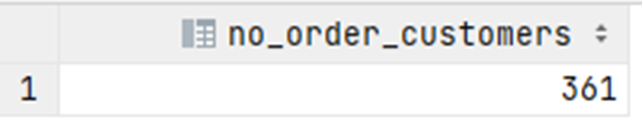

# Exercise 11

How many customers have not placed any orders?

<details>
<summary>Show answer</summary>



</details>

<br/>

<details>
<summary>Show SQL</summary>

```sql
SELECT COUNT(customer_id) AS no_order_customers
FROM customer
WHERE customer_id NOT IN (SELECT customer_id FROM "order");
```

</details>