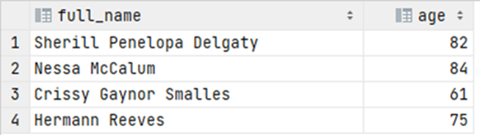

# Exercise 12

Which customers have birthday today? Return names as a string and their age. Note: answer will vary, the
query is the same.

<details>
<summary>Show answer</summary>



</details>

<br/>

<details>
<summary>Show SQL</summary>

```sql
SELECT  CONCAT_WS(' ', first_name, middle_name, last_name) AS fulle_name,
        DATE_PART('year', AGE(birthdate)) AS age
FROM customer
WHERE DATE_PART('day', birthdate) = DATE_PART('day', CURRENT_TIMESTAMP)
    AND DATE_PART('month', birthdate) = DATE_PART('month', CURRENT_TIMESTAMP);
```

</details>
