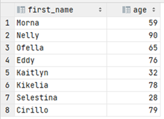

# Exercise 13

Find the first name and age of all customers from Denmark.

<details>
<summary>Show answer</summary>



</details>

<br/>

<details>
<summary>Show SQL</summary>

```sql
SELECT first_name, date_part('year', age(birthdate)) as age
FROM    customer c,
        address a,
        zipcode z,
        country co
WHERE c.customer_id = a.customer_id
AND a.zip_code = z.zip_code
AND z.country_code = co.country_code
AND co.country_name = 'Denmark';
```

</details>

